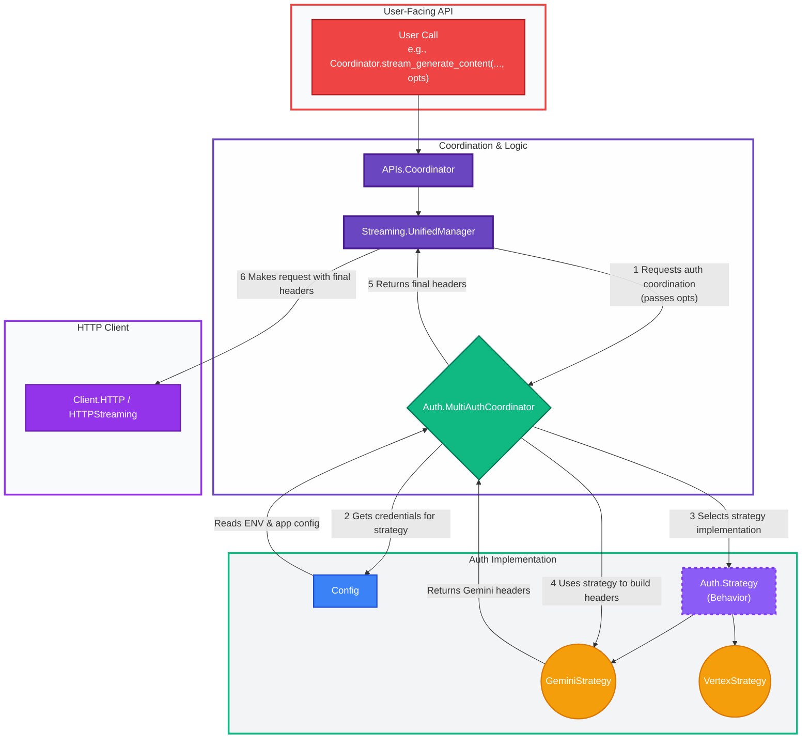

Of course. Here is a detailed technical documentation for the authentication system of the provided Elixir library, complete with a Mermaid diagram to visualize the architecture.

---

## Technical Documentation: Gemini Elixir Library Authentication System

### 1. Overview

The authentication system in this Elixir library is a sophisticated, multi-layered architecture designed for maximum flexibility and robustness. It allows developers to seamlessly switch between different Google AI authentication schemes without changing their application code.

The system is built on two core principles:

1.  **Dual-Strategy Support:** It natively supports both the simple **Gemini API Key** (`:gemini`) and the more complex **Vertex AI OAuth/JWT** (`:vertex_ai`) authentication methods.
2.  **Hierarchical Configuration:** It provides a clear and predictable order of precedence for sourcing credentials, prioritizing per-request overrides, then environment variables, and finally Elixir application configuration.

This design makes the library easy to use for simple scripts while being powerful enough for complex, multi-tenant production applications.

### 2. Core Concepts: Authentication Strategies

The system revolves around two distinct, pluggable strategies:

*   **:gemini Strategy**:
    *   **Method**: Uses a static API key.
    *   **Mechanism**: Adds the key to the `x-goog-api-key` HTTP header.
    *   **Use Case**: Ideal for quickstarts, personal projects, and scenarios where a simple, long-lived key is sufficient.

*   **:vertex_ai Strategy**:
    *   **Method**: Uses Google Cloud's standard Identity and Access Management (IAM).
    *   **Mechanism**: Generates short-lived OAuth2 Bearer tokens or self-signed JWTs from a service account.
    *   **Use Case**: The standard for production Google Cloud Platform applications, providing more secure, auditable, and role-based access.

### 3. System Architecture

The authentication system is composed of several distinct layers, each with a clear responsibility. This separation of concerns is key to its flexibility.

#### Mermaid Diagram of the Authentication Architecture



#### Architectural Layers Explained

**1. Configuration Layer (`gemini/config.ex`)**

*   **Purpose**: To detect and load the *default* authentication credentials for the application.
*   **Mechanism**: The `Gemini.Config.auth_config/0` function establishes a strict priority order for finding credentials:
    1.  **Environment Variables**: Checks for `GEMINI_API_KEY`, `VERTEX_SERVICE_ACCOUNT`, etc. This is the highest priority.
    2.  **Application Config**: If no environment variables are found, it checks for `:gemini, :auth` or `:gemini, :api_key` in the Elixir application environment (e.g., `config/runtime.exs`).
*   **Code Example (`gemini/config.ex`):**
    ```elixir
    def auth_config do
      cond do
        gemini_api_key() ->
          %{type: :gemini, credentials: %{api_key: gemini_api_key()}}
        # ... other checks for Vertex, etc.
        true ->
          Application.get_env(:gemini, :auth) # ...
      end
    end
    ```

**2. Abstraction Layer (`gemini/auth.ex`)**

*   **Purpose**: To define a common interface for all authentication strategies.
*   **Mechanism**: It defines the `Gemini.Auth.Strategy` behavior. Any module that implements this behavior must define functions like `headers/1` and `base_url/1`. This allows the rest of the system to interact with any authentication strategy in a uniform way.
*   **Code Example (`gemini/auth.ex`):**
    ```elixir
    defmodule Strategy do
      @callback headers(credentials :: map()) :: [{String.t(), String.t()}]
      @callback base_url(credentials :: map()) :: String.t()
      # ...
    end
    ```

**3. Implementation Layer (`gemini/auth/*_strategy.ex`)**

*   **Purpose**: To provide the concrete logic for each authentication strategy.
*   **Mechanism**:
    *   `GeminiStrategy` implements the `Strategy` behavior for API Key auth. Its `headers/1` function creates the `x-goog-api-key` header.
    *   `VertexStrategy` implements the same behavior for Vertex AI, handling the complexities of generating OAuth tokens.
*   **Code Example (`gemini/auth/gemini_strategy.ex`):**
    ```elixir
    def headers(%{api_key: api_key}) do
      [
        {"Content-Type", "application/json"},
        {"x-goog-api-key", api_key}
      ]
    end
    ```

**4. Coordination Layer (`gemini/auth/multi_auth_coordinator.ex`)**

*   **Purpose**: To be the central brain of the system, handling per-request logic and orchestrating the other layers. This is what enables a user to override the global configuration for a single API call.
*   **Mechanism**: The key function is `get_credentials(strategy, opts)`. It first checks the `opts` keyword list (passed from the user's function call) for overriding credentials (like `:api_key`). If an override is not present, it falls back to the default credentials loaded by the `Config` layer.
*   **Code Example (`gemini/auth/multi_auth_coordinator.ex`):**
    ```elixir
    def get_credentials(:gemini, opts) do
      base_config = Config.get_auth_config(:gemini)
      
      # Prioritize opts, then fall back to base_config
      api_key = Keyword.get(opts, :api_key, base_config[:api_key])
      
      # ... validation
    end
    ```

### 4. End-to-End Authentication Flow

Let's trace a user's call to see how these layers interact.

**Scenario:** A user wants to make a single streaming call with a specific, temporary API key, overriding their global configuration.

1.  **User Call**: The developer calls a high-level function in `APIs.Coordinator`, passing the `:api_key` in the `opts`.
    ```elixir
    Coordinator.stream_generate_content(
      "Tell me a story",
      auth: :gemini,
      api_key: "aiza-temporary-key-for-this-call"
    )
    ```

2.  **Delegation**: `APIs.Coordinator` delegates this call to the `Streaming.UnifiedManager`, passing along the `opts` unchanged.

3.  **Auth Coordination**: The `UnifiedManager` needs to get HTTP headers. It calls `MultiAuthCoordinator.coordinate_auth(:gemini, opts)`.

4.  **Credential Resolution**: The `MultiAuthCoordinator`'s `get_credentials/2` function is executed.
    *   It sees `api_key: "aiza-temporary-key-for-this-call"` inside the `opts`.
    *   It **uses this key** and ignores whatever might be configured in environment variables or `config/runtime.exs`.

5.  **Header Generation**: The `MultiAuthCoordinator` now has the correct credentials. It invokes the `:gemini` strategy (`GeminiStrategy.headers/1`) with these credentials.

6.  **Header Creation**: `GeminiStrategy` creates the final list of headers: `[{"x-goog-api-key", "aiza-temporary-key-for-this-call"}, ...]`.

7.  **HTTP Request**: The headers are returned up to the `UnifiedManager`, which then passes them to the `Client.HTTPStreaming` module to make the final, correctly authenticated HTTP request.

### 5. Configuration Guide for Library Users

To use the library, configure your credentials using one of the following methods, listed in order of precedence (Method 1 overrides Method 2, which overrides Method 3).

#### Method 1: Per-Request Override

For functions that support it (primarily in the streaming API), you can provide the authentication details directly in the `opts` of the function call.

```elixir
# This API key is used for this call only
opts = [
  auth: :gemini,
  api_key: "your_specific_api_key"
]
{:ok, stream_id} = Gemini.APIs.Coordinator.stream_generate_content("Hello", opts)
```

#### Method 2: Environment Variables (Recommended for Production)

This is the most secure and standard way to provide credentials in production, staging, and CI/CD environments.

*   **For Gemini API Key:**
    ```bash
    export GEMINI_API_KEY="your-google-ai-api-key"
    ```

*   **For Vertex AI (Service Account):**
    ```bash
    export VERTEX_SERVICE_ACCOUNT="/path/to/your/service-account.json"
    export VERTEX_PROJECT_ID="your-gcp-project-id"
    export VERTEX_LOCATION="us-central1"
    ```

The library will automatically detect and use these variables.

#### Method 3: Application Configuration (Standard Elixir Way)

Configure the library in your project's `config/runtime.exs` file. This is the canonical approach for managing secrets within an Elixir application.

*   **For Gemini API Key:**
    ```elixir
    # config/runtime.exs
    import Config

    # Best practice: Read from an environment variable
    config :gemini,
      api_key: System.fetch_env!("GEMINI_API_KEY")
    ```

*   **For Vertex AI (Service Account):**
    ```elixir
    # config/runtime.exs
    import Config

    config :gemini, :auth,
      type: :vertex_ai,
      credentials: %{
        service_account_key: System.fetch_env!("VERTEX_SERVICE_ACCOUNT_PATH"),
        project_id: System.fetch_env!("GCP_PROJECT_ID"),
        location: "us-central1"
      }
    ```

---
