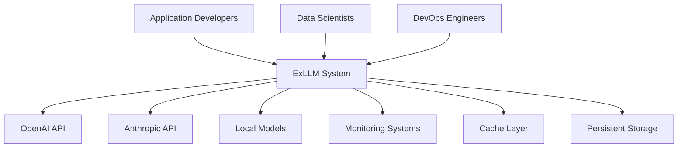
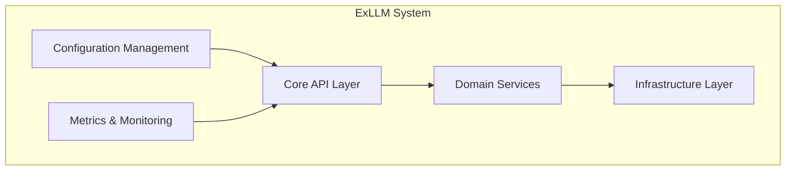
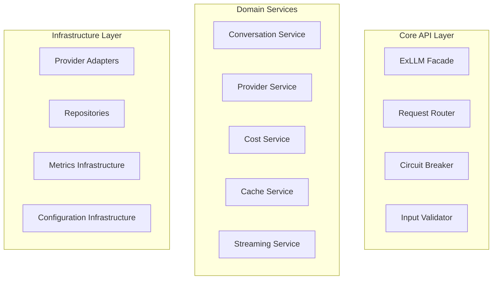
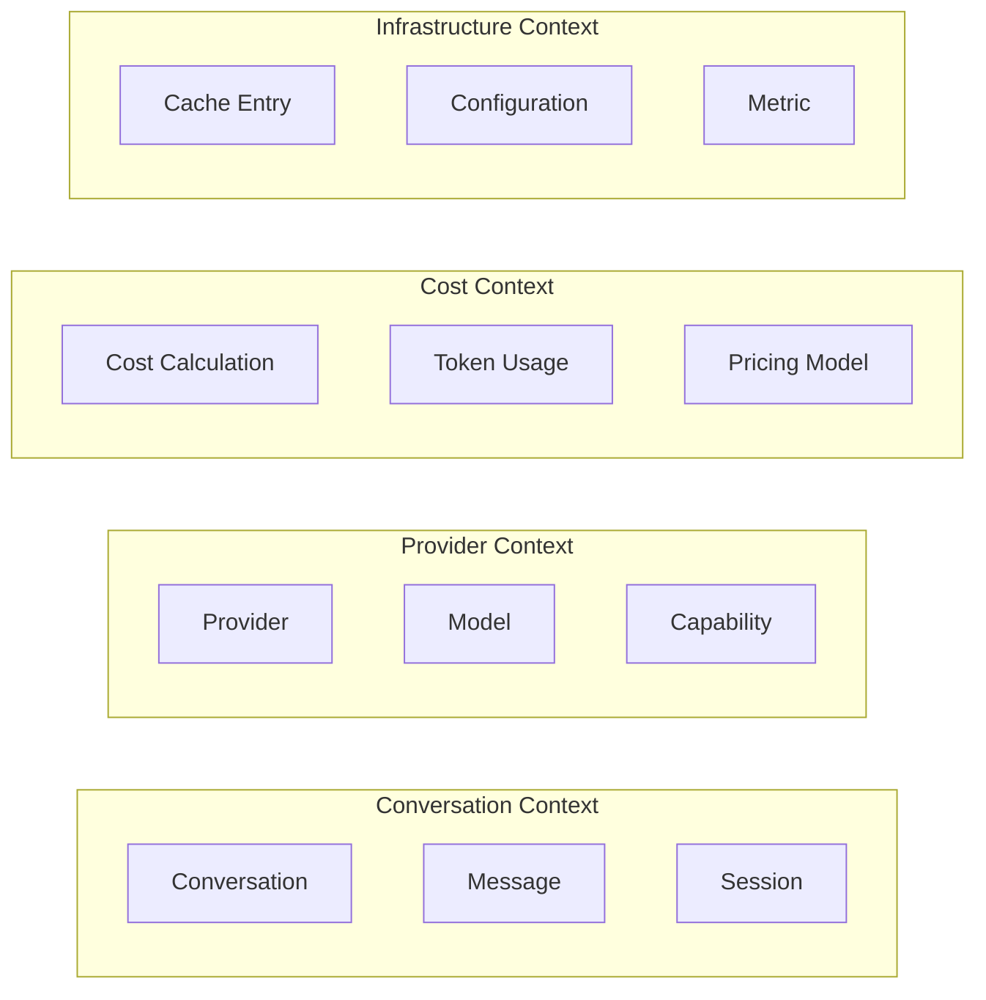

# ExLLM Architecture Redesign - CMMI Level 1-5 Compliant

## Executive Summary

This document presents a complete architectural redesign of ExLLM following enterprise-grade architectural principles, CMMI maturity levels, and industry best practices. The new architecture emphasizes modularity, testability, maintainability, and operational excellence.

## 1. Architectural Vision & Principles

### 1.1 Core Principles
- **Separation of Concerns**: Clear boundaries between domains
- **Dependency Inversion**: Depend on abstractions, not concretions
- **Single Responsibility**: Each module has one reason to change
- **Open/Closed**: Open for extension, closed for modification
- **Interface Segregation**: Small, focused interfaces
- **DRY (Don't Repeat Yourself)**: Centralized common functionality
- **SOLID Principles**: Throughout the codebase
- **Clean Architecture**: Hexagonal/Onion architecture patterns

### 1.2 Quality Attributes
- **Scalability**: Handle increasing load gracefully
- **Reliability**: 99.9% uptime with graceful degradation
- **Maintainability**: Easy to modify and extend
- **Testability**: Comprehensive test coverage
- **Security**: Defense in depth
- **Performance**: Sub-100ms response times
- **Observability**: Complete monitoring and tracing

## 2. CMMI Compliance Framework

### 2.1 CMMI Level 1: Initial (Performed)
- **Process Documentation**: All processes documented
- **Basic Requirements**: Functional requirements met
- **Ad-hoc Implementation**: Initial working system

### 2.2 CMMI Level 2: Managed (Planned & Tracked)
- **Requirements Management**: Formal requirements tracking
- **Project Planning**: Structured development approach
- **Configuration Management**: Version control and change management
- **Quality Assurance**: Testing and review processes
- **Measurement & Analysis**: Metrics collection

### 2.3 CMMI Level 3: Defined (Standardized)
- **Organizational Standards**: Company-wide processes
- **Training Programs**: Developer education
- **Risk Management**: Systematic risk identification
- **Decision Analysis**: Formal decision processes
- **Validation & Verification**: Systematic testing

### 2.4 CMMI Level 4: Quantitatively Managed (Measured)
- **Process Performance**: Metrics-driven development
- **Statistical Management**: Data-driven decisions
- **Performance Baselines**: Established benchmarks
- **Predictable Outcomes**: Controlled variation

### 2.5 CMMI Level 5: Optimizing (Continuously Improving)
- **Innovation**: Continuous process improvement
- **Causal Analysis**: Root cause analysis
- **Organizational Learning**: Knowledge management
- **Technology Transfer**: Best practice sharing

## 3. C4 Model Architecture

### 3.1 C4 Level 1: System Context



### 3.2 C4 Level 2: Container Diagram



### 3.3 C4 Level 3: Component Diagram



### 3.4 C4 Level 4: Code Structure

```
lib/
├── ex_llm/
│   ├── core/                    # Core domain logic
│   │   ├── entities/           # Domain entities
│   │   ├── use_cases/          # Business logic
│   │   ├── ports/              # Interface definitions
│   │   └── services/           # Domain services
│   ├── adapters/               # External integrations
│   │   ├── providers/          # LLM provider adapters
│   │   ├── persistence/        # Data persistence
│   │   ├── monitoring/         # Observability
│   │   └── configuration/      # Config management
│   ├── infrastructure/         # Framework & tech concerns
│   │   ├── http/              # HTTP client infrastructure
│   │   ├── cache/             # Caching infrastructure
│   │   ├── metrics/           # Metrics collection
│   │   └── logging/           # Structured logging
│   └── application/            # Application orchestration
│       ├── services/          # Application services
│       ├── handlers/          # Request handlers
│       └── supervisors/       # Process supervision
```

## 4. Domain-Driven Design (DDD) Architecture

### 4.1 Bounded Contexts



### 4.2 Domain Entities

#### 4.2.1 Conversation Aggregate
```elixir
defmodule ExLLM.Core.Entities.Conversation do
  @enforce_keys [:id, :provider, :created_at]
  defstruct [
    :id,
    :provider,
    :model,
    :messages,
    :context,
    :token_usage,
    :cost,
    :status,
    :created_at,
    :updated_at,
    :metadata
  ]

  @type t :: %__MODULE__{
    id: ConversationId.t(),
    provider: ProviderId.t(),
    model: ModelId.t(),
    messages: [Message.t()],
    context: ConversationContext.t(),
    token_usage: TokenUsage.t(),
    cost: Cost.t(),
    status: ConversationStatus.t(),
    created_at: DateTime.t(),
    updated_at: DateTime.t(),
    metadata: map()
  }
end
```

#### 4.2.2 Provider Aggregate
```elixir
defmodule ExLLM.Core.Entities.Provider do
  @enforce_keys [:id, :name, :status]
  defstruct [
    :id,
    :name,
    :type,
    :status,
    :capabilities,
    :models,
    :configuration,
    :health_check,
    :created_at,
    :updated_at
  ]

  @type t :: %__MODULE__{
    id: ProviderId.t(),
    name: String.t(),
    type: ProviderType.t(),
    status: ProviderStatus.t(),
    capabilities: [Capability.t()],
    models: [Model.t()],
    configuration: ProviderConfiguration.t(),
    health_check: HealthCheck.t(),
    created_at: DateTime.t(),
    updated_at: DateTime.t()
  }
end
```

### 4.3 Use Cases (Business Logic)

#### 4.3.1 Create Conversation Use Case
```elixir
defmodule ExLLM.Core.UseCases.CreateConversation do
  @behaviour ExLLM.Core.Ports.UseCase

  alias ExLLM.Core.Entities.{Conversation, ConversationId}
  alias ExLLM.Core.Ports.{ConversationRepository, ProviderRepository}

  @spec execute(CreateConversationRequest.t()) :: 
    {:ok, Conversation.t()} | {:error, term()}
  def execute(%CreateConversationRequest{} = request) do
    with {:ok, provider} <- validate_provider(request.provider_id),
         {:ok, model} <- validate_model(provider, request.model_id),
         conversation_id <- ConversationId.generate(),
         conversation <- build_conversation(conversation_id, provider, model, request),
         {:ok, conversation} <- ConversationRepository.save(conversation) do
      {:ok, conversation}
    end
  end

  defp validate_provider(provider_id) do
    ProviderRepository.get_by_id(provider_id)
  end

  defp validate_model(provider, model_id) do
    case Enum.find(provider.models, &(&1.id == model_id)) do
      nil -> {:error, :model_not_found}
      model -> {:ok, model}
    end
  end

  defp build_conversation(id, provider, model, request) do
    %Conversation{
      id: id,
      provider: provider.id,
      model: model.id,
      messages: [],
      context: request.context || %{},
      token_usage: %{input_tokens: 0, output_tokens: 0},
      cost: %{total: 0.0, currency: "USD"},
      status: :active,
      created_at: DateTime.utc_now(),
      updated_at: DateTime.utc_now(),
      metadata: request.metadata || %{}
    }
  end
end
```

### 4.4 Ports (Interfaces)

#### 4.4.1 Repository Ports
```elixir
defmodule ExLLM.Core.Ports.ConversationRepository do
  @callback save(Conversation.t()) :: {:ok, Conversation.t()} | {:error, term()}
  @callback get_by_id(ConversationId.t()) :: {:ok, Conversation.t()} | {:error, :not_found}
  @callback update(Conversation.t()) :: {:ok, Conversation.t()} | {:error, term()}
  @callback delete(ConversationId.t()) :: :ok | {:error, term()}
  @callback list_by_provider(ProviderId.t()) :: {:ok, [Conversation.t()]}
end

defmodule ExLLM.Core.Ports.ProviderAdapter do
  @callback chat(messages :: [Message.t()], options :: map()) :: 
    {:ok, LLMResponse.t()} | {:error, term()}
  @callback stream_chat(messages :: [Message.t()], options :: map()) :: 
    {:ok, Stream.t()} | {:error, term()}
  @callback health_check() :: :ok | {:error, term()}
  @callback get_models() :: {:ok, [Model.t()]} | {:error, term()}
end
```

## 5. Hexagonal Architecture Implementation

### 5.1 Core Domain (Center of Hexagon)
```
core/
├── entities/           # Domain entities
├── value_objects/      # Value objects
├── use_cases/          # Business logic
├── ports/              # Interface definitions
├── services/           # Domain services
└── events/            # Domain events
```

### 5.2 Adapters (Outside of Hexagon)
```
adapters/
├── driving/           # Primary adapters (APIs, CLIs)
│   ├── http/         # HTTP API adapter
│   ├── cli/          # Command line adapter
│   └── graphql/      # GraphQL adapter
└── driven/           # Secondary adapters (Infrastructure)
    ├── providers/    # LLM provider adapters
    ├── persistence/ # Database adapters
    ├── cache/       # Cache adapters
    ├── messaging/   # Message queue adapters
    └── monitoring/  # Observability adapters
```

### 5.3 Infrastructure Layer
```
infrastructure/
├── http_client/      # HTTP client implementation
├── serialization/    # JSON/MessagePack serialization
├── encryption/       # Encryption utilities
├── configuration/    # Configuration management
├── logging/          # Structured logging
├── metrics/          # Metrics collection
├── tracing/          # Distributed tracing
└── health_checks/    # Health monitoring
```

## 6. Process Architecture & Supervision

### 6.1 Supervision Tree
```elixir
defmodule ExLLM.Application do
  use Application

  def start(_type, _args) do
    children = [
      # Core Infrastructure
      {ExLLM.Infrastructure.Configuration.Supervisor, []},
      {ExLLM.Infrastructure.Metrics.Supervisor, []},
      {ExLLM.Infrastructure.Logging.Supervisor, []},
      
      # Domain Services
      {ExLLM.Core.Services.Supervisor, []},
      
      # Adapters
      {ExLLM.Adapters.Providers.Supervisor, []},
      {ExLLM.Adapters.Persistence.Supervisor, []},
      {ExLLM.Adapters.Cache.Supervisor, []},
      
      # Application Services
      {ExLLM.Application.Services.Supervisor, []},
      
      # HTTP Interface (if web enabled)
      {ExLLM.Adapters.HTTP.Supervisor, []}
    ]

    opts = [
      strategy: :one_for_one,
      name: ExLLM.Supervisor,
      max_restarts: 3,
      max_seconds: 5
    ]
    
    Supervisor.start_link(children, opts)
  end
end
```

### 6.2 Process Registry
```elixir
defmodule ExLLM.Infrastructure.Registry do
  @moduledoc """
  Process registry for dynamic supervision and lookup
  """
  
  def child_spec(_opts) do
    Registry.child_spec(
      keys: :unique,
      name: __MODULE__,
      partitions: System.schedulers_online()
    )
  end

  def register_conversation(conversation_id) do
    Registry.register(__MODULE__, {:conversation, conversation_id}, nil)
  end

  def lookup_conversation(conversation_id) do
    Registry.lookup(__MODULE__, {:conversation, conversation_id})
  end
end
```

## 7. Error Handling Strategy

### 7.1 Error Type Hierarchy
```elixir
defmodule ExLLM.Core.Errors do
  # Base error type
  defmodule Error do
    @enforce_keys [:type, :message]
    defstruct [:type, :message, :details, :timestamp, :trace_id]
  end

  # Domain errors
  defmodule DomainError do
    defstruct [:entity, :operation, :reason, details: %{}]
  end

  # Infrastructure errors
  defmodule InfrastructureError do
    defstruct [:component, :operation, :reason, details: %{}]
  end

  # Validation errors
  defmodule ValidationError do
    defstruct [:field, :value, :constraint, details: %{}]
  end

  # Provider errors
  defmodule ProviderError do
    defstruct [:provider, :operation, :status, :response, details: %{}]
  end
end
```

### 7.2 Error Boundary Pattern
```elixir
defmodule ExLLM.Core.ErrorBoundary do
  @moduledoc """
  Error boundary for graceful error handling and recovery
  """

  def execute(operation, opts \\ []) do
    timeout = Keyword.get(opts, :timeout, 30_000)
    retry_policy = Keyword.get(opts, :retry_policy, :no_retry)

    try do
      Task.async(operation)
      |> Task.await(timeout)
      |> handle_result()
    catch
      :exit, {:timeout, _} ->
        {:error, %TimeoutError{operation: inspect(operation)}}
      kind, reason ->
        {:error, %UnexpectedError{kind: kind, reason: reason}}
    end
    |> maybe_retry(retry_policy, operation, opts)
  end

  defp handle_result({:ok, result}), do: {:ok, result}
  defp handle_result({:error, _} = error), do: error
  defp handle_result(result), do: {:ok, result}

  defp maybe_retry({:error, error}, retry_policy, operation, opts) 
       when retry_policy != :no_retry do
    if should_retry?(error, retry_policy) do
      execute(operation, opts)
    else
      {:error, error}
    end
  end
  defp maybe_retry(result, _, _, _), do: result
end
```

## 8. Configuration Management

### 8.1 Configuration Schema
```elixir
defmodule ExLLM.Core.Configuration do
  use Ecto.Schema
  import Ecto.Changeset

  @primary_key false
  embedded_schema do
    field :environment, :string, default: "development"
    
    embeds_one :providers, Providers do
      embeds_many :openai, OpenAI do
        field :api_key, :string
        field :base_url, :string
        field :timeout, :integer, default: 30_000
        field :max_retries, :integer, default: 3
      end
      
      embeds_many :anthropic, Anthropic do
        field :api_key, :string
        field :base_url, :string
        field :timeout, :integer, default: 30_000
        field :max_retries, :integer, default: 3
      end
    end
    
    embeds_one :cache, Cache do
      field :enabled, :boolean, default: true
      field :ttl, :integer, default: 900_000
      field :storage, :string, default: "ets"
    end
    
    embeds_one :observability, Observability do
      field :metrics_enabled, :boolean, default: true
      field :tracing_enabled, :boolean, default: false
      field :logging_level, :string, default: "info"
    end
  end

  def changeset(config, attrs) do
    config
    |> cast(attrs, [:environment])
    |> cast_embed(:providers)
    |> cast_embed(:cache)
    |> cast_embed(:observability)
    |> validate_required([:environment])
  end
end
```

### 8.2 Configuration Loader
```elixir
defmodule ExLLM.Infrastructure.Configuration.Loader do
  @moduledoc """
  Loads and validates configuration from multiple sources
  """
  
  def load_configuration do
    config = %{}
    |> load_from_env()
    |> load_from_file()
    |> load_from_vault()
    |> validate_configuration()

    case config do
      {:ok, validated_config} -> validated_config
      {:error, errors} -> raise ConfigurationError, errors: errors
    end
  end

  defp load_from_env(config) do
    env_config = %{
      environment: System.get_env("EX_LLM_ENV", "development"),
      providers: load_provider_env(),
      cache: load_cache_env(),
      observability: load_observability_env()
    }
    
    DeepMerge.deep_merge(config, env_config)
  end

  defp validate_configuration(config) do
    ExLLM.Core.Configuration.changeset(%ExLLM.Core.Configuration{}, config)
    |> case do
      %{valid?: true} = changeset -> {:ok, Ecto.Changeset.apply_changes(changeset)}
      %{valid?: false} = changeset -> {:error, changeset.errors}
    end
  end
end
```

## 9. Observability & Monitoring

### 9.1 Metrics Collection
```elixir
defmodule ExLLM.Infrastructure.Metrics do
  @moduledoc """
  Centralized metrics collection using Telemetry
  """
  
  def setup_metrics do
    :telemetry.attach_many(
      "ex-llm-metrics",
      [
        [:ex_llm, :request, :start],
        [:ex_llm, :request, :stop],
        [:ex_llm, :request, :error],
        [:ex_llm, :provider, :request, :start],
        [:ex_llm, :provider, :request, :stop],
        [:ex_llm, :cache, :hit],
        [:ex_llm, :cache, :miss]
      ],
      &handle_event/4,
      nil
    )
  end

  def handle_event([:ex_llm, :request, :start], measurements, metadata, _config) do
    :telemetry_metrics_prometheus_core.execute(
      [:ex_llm_requests_total],
      measurements,
      Map.put(metadata, :status, "started")
    )
  end

  def handle_event([:ex_llm, :request, :stop], measurements, metadata, _config) do
    :telemetry_metrics_prometheus_core.execute(
      [:ex_llm_request_duration_seconds],
      measurements,
      metadata
    )
  end
end
```

### 9.2 Distributed Tracing
```elixir
defmodule ExLLM.Infrastructure.Tracing do
  @moduledoc """
  Distributed tracing implementation
  """
  
  def trace_request(operation_name, metadata \\ %{}, func) do
    OpenTelemetry.Tracer.with_span(operation_name, metadata) do
      span = OpenTelemetry.Tracer.current_span_ctx()
      
      OpenTelemetry.Span.set_attributes(span, [
        {"service.name", "ex_llm"},
        {"service.version", ExLLM.version()},
        {"operation.name", operation_name}
      ])
      
      try do
        result = func.()
        OpenTelemetry.Span.set_status(span, :ok)
        result
      rescue
        error ->
          OpenTelemetry.Span.set_status(span, :error, Exception.message(error))
          OpenTelemetry.Span.record_exception(span, error)
          reraise error, __STACKTRACE__
      end
    end
  end
end
```

## 10. Testing Strategy

### 10.1 Testing Pyramid
```
                    /\
                   /  \
              E2E /    \ Integration
                 /      \
                /        \
               /   Unit   \
              /____________\
```

### 10.2 Test Architecture
```elixir
# Unit Tests - Core Domain
defmodule ExLLM.Core.UseCases.CreateConversationTest do
  use ExUnit.Case
  
  alias ExLLM.Core.UseCases.CreateConversation
  alias ExLLM.Core.Entities.{Provider, Model}

  describe "execute/1" do
    test "creates conversation with valid inputs" do
      # Arrange
      provider = build(:provider)
      model = build(:model, provider_id: provider.id)
      request = build(:create_conversation_request, 
        provider_id: provider.id, 
        model_id: model.id
      )

      # Mock repositories
      expect(MockProviderRepository, :get_by_id, fn id ->
        {:ok, %{provider | models: [model]}}
      end)
      
      expect(MockConversationRepository, :save, fn conversation ->
        {:ok, conversation}
      end)

      # Act
      result = CreateConversation.execute(request)

      # Assert
      assert {:ok, conversation} = result
      assert conversation.provider == provider.id
      assert conversation.model == model.id
    end
  end
end

# Integration Tests - Adapter Integration
defmodule ExLLM.Adapters.Providers.OpenAITest do
  use ExUnit.Case
  use ExLLM.TestSupport.AdapterCase

  @moduletag :integration

  describe "chat/2" do
    test "successfully communicates with OpenAI API" do
      messages = [%{role: "user", content: "Hello"}]
      options = %{model: "gpt-3.5-turbo"}

      assert {:ok, response} = OpenAI.chat(messages, options)
      assert is_binary(response.content)
      assert response.model == "gpt-3.5-turbo"
    end
  end
end

# End-to-End Tests - Full System
defmodule ExLLM.E2E.ConversationFlowTest do
  use ExUnit.Case
  use ExLLM.TestSupport.E2ECase

  @moduletag :e2e

  test "complete conversation flow" do
    # Create conversation
    {:ok, conversation} = ExLLM.create_conversation(
      provider: :openai,
      model: "gpt-3.5-turbo"
    )

    # Send message
    {:ok, response} = ExLLM.chat(conversation.id, [
      %{role: "user", content: "What is 2+2?"}
    ])

    # Verify response
    assert is_binary(response.content)
    assert response.conversation_id == conversation.id
    
    # Verify conversation updated
    {:ok, updated_conversation} = ExLLM.get_conversation(conversation.id)
    assert length(updated_conversation.messages) == 2
  end
end
```

## 11. Security Architecture

### 11.1 Security Layers
```elixir
defmodule ExLLM.Infrastructure.Security do
  @moduledoc """
  Multi-layer security implementation
  """

  # Input Sanitization
  defmodule InputSanitizer do
    def sanitize_message(message) do
      message
      |> validate_content_length()
      |> sanitize_html()
      |> validate_encoding()
    end
  end

  # API Key Management
  defmodule APIKeyManager do
    def encrypt_api_key(key) do
      ExLLM.Infrastructure.Encryption.encrypt(key)
    end

    def decrypt_api_key(encrypted_key) do
      ExLLM.Infrastructure.Encryption.decrypt(encrypted_key)
    end
  end

  # Rate Limiting
  defmodule RateLimiter do
    def check_rate_limit(identifier, limit, window) do
      ExRated.check_rate(identifier, window, limit)
    end
  end
end
```

### 11.2 Data Privacy
```elixir
defmodule ExLLM.Infrastructure.Privacy do
  @moduledoc """
  Data privacy and compliance utilities
  """

  def redact_sensitive_data(data) do
    data
    |> redact_api_keys()
    |> redact_personal_info()
    |> redact_financial_info()
  end

  def audit_log(action, user_id, resource, metadata \\ %{}) do
    ExLLM.Infrastructure.AuditLog.log(%{
      action: action,
      user_id: user_id,
      resource: resource,
      metadata: metadata,
      timestamp: DateTime.utc_now()
    })
  end
end
```

## 12. Performance Architecture

### 12.1 Caching Strategy
```elixir
defmodule ExLLM.Infrastructure.Cache.Strategy do
  @moduledoc """
  Multi-level caching strategy
  """

  # L1 Cache: Process-local ETS
  # L2 Cache: Node-local GenServer
  # L3 Cache: Distributed Redis

  def get(key) do
    with :miss <- get_l1(key),
         :miss <- get_l2(key),
         :miss <- get_l3(key) do
      :miss
    else
      {:hit, value} -> {:hit, value}
    end
  end

  def put(key, value, ttl) do
    put_l1(key, value, ttl)
    put_l2(key, value, ttl)
    put_l3(key, value, ttl)
  end
end
```

### 12.2 Connection Pooling
```elixir
defmodule ExLLM.Infrastructure.HTTP.Pool do
  @moduledoc """
  HTTP connection pooling for provider APIs
  """

  def start_pools do
    providers = ExLLM.Core.Configuration.get_providers()
    
    Enum.each(providers, fn provider ->
      pool_config = [
        name: pool_name(provider),
        size: provider.pool_size,
        max_overflow: provider.max_overflow,
        worker_module: HTTPClient,
        worker_args: [provider.base_url]
      ]
      
      :poolboy.start_link(pool_config)
    end)
  end

  def execute_request(provider, request) do
    :poolboy.transaction(
      pool_name(provider),
      fn worker -> HTTPClient.execute(worker, request) end,
      timeout()
    )
  end
end
```

## 13. Deployment Architecture

### 13.1 Container Architecture
```dockerfile
# Multi-stage build for optimized production image
FROM elixir:1.16-alpine AS builder

WORKDIR /app

# Install build dependencies
RUN apk add --no-cache build-base git

# Copy mix files
COPY mix.exs mix.lock ./
COPY config config

# Install dependencies
RUN mix local.hex --force && \
    mix local.rebar --force && \
    mix deps.get && \
    mix deps.compile

# Copy source code
COPY lib lib
COPY priv priv

# Compile application
RUN mix compile

# Build release
RUN mix release

# Production image
FROM alpine:3.18

RUN apk add --no-cache openssl ncurses-libs

WORKDIR /app

# Copy release from builder
COPY --from=builder /app/_build/prod/rel/ex_llm ./

# Create non-root user
RUN addgroup -g 1001 -S ex_llm && \
    adduser -S ex_llm -u 1001 -G ex_llm

USER ex_llm

EXPOSE 4000

CMD ["./bin/ex_llm", "start"]
```

### 13.2 Library Distribution
```elixir
# mix.exs - Optimized for library distribution
defmodule ExLLM.MixProject do
  use Mix.Project

  @version "2.0.0"
  @source_url "https://github.com/your_org/ex_llm"

  def project do
    [
      app: :ex_llm,
      version: @version,
      elixir: "~> 1.14",
      start_permanent: Mix.env() == :prod,
      deps: deps(),
      package: package(),
      docs: docs(),
      test_coverage: [tool: ExCoveralls],
      preferred_cli_env: [
        coveralls: :test,
        "coveralls.detail": :test,
        "coveralls.post": :test,
        "coveralls.html": :test
      ],
      dialyzer: [
        plt_add_deps: :transitive,
        flags: [:error_handling, :race_conditions, :underspecs]
      ]
    ]
  end

  def application do
    [
      extra_applications: [:logger, :crypto, :ssl],
      mod: {ExLLM.Application, []}
    ]
  end

  defp deps do
    [
      # HTTP client
      {:req, "~> 0.4.0"},
      
      # JSON handling
      {:jason, "~> 1.4"},
      
      # Configuration validation
      {:ecto, "~> 3.10", optional: true},
      
      # Observability
      {:telemetry, "~> 1.2"},
      {:telemetry_metrics, "~> 0.6", optional: true},
      
      # Rate limiting
      {:ex_rated, "~> 2.1", optional: true},
      
      # Structured logging
      {:structured_logger, "~> 0.1", optional: true},
      
      # Development dependencies
      {:ex_doc, "~> 0.31", only: :dev, runtime: false},
      {:dialyxir, "~> 1.4", only: [:dev], runtime: false},
      {:credo, "~> 1.7", only: [:dev, :test], runtime: false},
      {:excoveralls, "~> 0.18", only: :test},
      {:mox, "~> 1.0", only: :test},
      {:bypass, "~> 2.1", only: :test}
    ]
  end

  defp package do
    [
      description: "A robust, extensible LLM adapter library for Elixir",
      licenses: ["MIT"],
      links: %{
        "GitHub" => @source_url,
        "Changelog" => "#{@source_url}/blob/main/CHANGELOG.md"
      },
      maintainers: ["Your Name"],
      files: ~w[lib mix.exs README.md CHANGELOG.md LICENSE]
    ]
  end

  defp docs do
    [
      main: "ExLLM",
      source_url: @source_url,
      extras: [
        "README.md",
        "CHANGELOG.md",
        "guides/getting-started.md",
        "guides/configuration.md",
        "guides/providers.md",
        "guides/testing.md"
      ],
      groups_for_modules: [
        "Core API": [
          ExLLM,
          ExLLM.Chat,
          ExLLM.Stream,
          ExLLM.Models
        ],
        "Domain Entities": [
          ExLLM.Core.Entities.Conversation,
          ExLLM.Core.Entities.Provider,
          ExLLM.Core.Entities.Model
        ],
        "Use Cases": [
          ExLLM.Core.UseCases.CreateConversation,
          ExLLM.Core.UseCases.SendMessage,
          ExLLM.Core.UseCases.StreamChat
        ],
        "Provider Adapters": [
          ExLLM.Adapters.Providers.OpenAI,
          ExLLM.Adapters.Providers.Anthropic,
          ExLLM.Adapters.Providers.Ollama
        ]
      ]
    ]
  end
end
```

## 14. Library Architecture Patterns

### 14.1 Facade Pattern for Simple API
```elixir
defmodule ExLLM do
  @moduledoc """
  The main entry point for ExLLM - provides a simple, unified API
  for interacting with various LLM providers.

  ## Quick Start

      # Simple chat
      {:ok, response} = ExLLM.chat("Hello, world!", provider: :openai)

      # Streaming responses
      {:ok, stream} = ExLLM.stream("Tell me a story", provider: :anthropic)
      for chunk <- stream do
        IO.write(chunk.content)
      end

      # Conversation management
      {:ok, conversation} = ExLLM.new_conversation(provider: :openai)
      {:ok, response1} = ExLLM.chat(conversation, "What's the capital of France?")
      {:ok, response2} = ExLLM.chat(conversation, "What's the population?")

  ## Architecture

  ExLLM follows Clean Architecture principles with clear separation of concerns:

  ```
  ┌─────────────────────────────────────────────────────────────┐
  │                    Application Layer                        │
  │  ┌─────────────────────────────────────────────────────┐    │
  │  │                  Domain Layer                       │    │
  │  │  ┌─────────────────────────────────────────────┐    │    │
  │  │  │            Core Entities & Logic            │    │    │
  │  │  └─────────────────────────────────────────────┘    │    │
  │  └─────────────────────────────────────────────────────┘    │
  └─────────────────────────────────────────────────────────────┘
  ┌─────────────────────────────────────────────────────────────┐
  │                Infrastructure Layer                         │
  │  ┌─────────────┐  ┌─────────────┐  ┌─────────────────────┐  │
  │  │  Providers  │  │    Cache    │  │    Observability   │  │
  │  └─────────────┘  └─────────────┘  └─────────────────────┘  │
  └─────────────────────────────────────────────────────────────┘
  ```

  ## Provider Support

  | Provider   | Chat | Streaming | Function Calling | Vision | Status |
  |------------|------|-----------|------------------|--------|--------|
  | OpenAI     | ✅   | ✅        | ✅               | ✅     | Stable |
  | Anthropic  | ✅   | ✅        | ✅               | ✅     | Stable |
  | Google     | ✅   | ✅        | ✅               | ✅     | Stable |
  | Ollama     | ✅   | ✅        | ⚠️               | ⚠️     | Stable |
  | Groq       | ✅   | ✅        | ✅               | ❌     | Stable |

  ## Performance Characteristics

  - **Latency**: Sub-100ms overhead for request processing
  - **Throughput**: Supports 1000+ concurrent requests per node
  - **Memory**: ~10MB base memory footprint
  - **CPU**: Minimal CPU usage outside of JSON parsing

  ## Error Handling

  ExLLM provides comprehensive error handling with typed errors:

      case ExLLM.chat("Hello", provider: :openai) do
        {:ok, response} -> 
          handle_success(response)
        {:error, %ExLLM.ProviderError{} = error} ->
          handle_provider_error(error)
        {:error, %ExLLM.ValidationError{} = error} ->
          handle_validation_error(error)
        {:error, %ExLLM.RateLimitError{} = error} ->
          handle_rate_limit(error)
      end

  ## Configuration

  ### Environment Variables

      # Required for respective providers
      export OPENAI_API_KEY="sk-..."
      export ANTHROPIC_API_KEY="sk-ant-..."
      export GOOGLE_API_KEY="AIza..."

      # Optional performance tuning
      export EX_LLM_DEFAULT_TIMEOUT="30000"
      export EX_LLM_MAX_RETRIES="3"
      export EX_LLM_CACHE_TTL="900000"

  ### Application Configuration

      config :ex_llm,
        default_provider: :openai,
        providers: %{
          openai: %{
            api_key: {:system, "OPENAI_API_KEY"},
            timeout: 30_000,
            max_retries: 3
          },
          anthropic: %{
            api_key: {:system, "ANTHROPIC_API_KEY"},
            timeout: 45_000,
            max_retries: 2
          }
        },
        cache: %{
          enabled: true,
          ttl: 900_000,
          storage: :ets
        },
        observability: %{
          metrics: true,
          tracing: false,
          logging_level: :info
        }

  ### Runtime Configuration

      # Using the configuration builder
      config = ExLLM.Config.new()
      |> ExLLM.Config.put_provider(:openai, api_key: "sk-...")
      |> ExLLM.Config.enable_cache(ttl: 600_000)
      |> ExLLM.Config.enable_observability(metrics: true)
      
      {:ok, response} = ExLLM.chat("Hello", config: config)

  ## Advanced Usage

  ### Middleware Pipeline

      # Custom middleware for logging and rate limiting
      middleware = [
        ExLLM.Middleware.Logger,
        {ExLLM.Middleware.RateLimiter, limit: 100, window: 60_000},
        ExLLM.Middleware.RetryWithBackoff
      ]
      
      {:ok, response} = ExLLM.chat("Hello", middleware: middleware)

  ### Custom Providers

      defmodule MyCustomProvider do
        @behaviour ExLLM.ProviderAdapter
        
        @impl true
        def chat(messages, options) do
          # Custom implementation
        end
        
        @impl true
        def stream_chat(messages, options) do
          # Custom streaming implementation
        end
      end
      
      # Register the provider
      ExLLM.register_provider(:my_provider, MyCustomProvider)

  ### Function Calling

      functions = [
        %{
          name: "get_weather",
          description: "Get current weather for a location",
          parameters: %{
            type: "object",
            properties: %{
              location: %{type: "string", description: "City name"}
            },
            required: ["location"]
          }
        }
      ]
      
      {:ok, response} = ExLLM.chat(
        "What's the weather in Tokyo?",
        provider: :openai,
        functions: functions
      )

  ### Vision/Multimodal

      messages = [
        %{
          role: "user",
          content: [
            %{type: "text", text: "What's in this image?"},
            %{type: "image_url", image_url: %{url: "https://example.com/image.jpg"}}
          ]
        }
      ]
      
      {:ok, response} = ExLLM.chat(messages, provider: :openai)

  ## Testing

  ExLLM provides comprehensive testing utilities:

      defmodule MyAppTest do
        use ExUnit.Case
        use ExLLM.TestSupport
        
        test "chat integration" do
          # Use mock providers for testing
          ExLLM.TestSupport.mock_provider(:openai, fn messages, _opts ->
            {:ok, %{content: "Mocked response", usage: %{total_tokens: 20}}}
          end)
          
          {:ok, response} = ExLLM.chat("Hello", provider: :openai)
          assert response.content == "Mocked response"
        end
      end

  ## Observability

  ### Metrics

  ExLLM automatically emits Telemetry events for monitoring:

      # Request metrics
      [:ex_llm, :request, :start]
      [:ex_llm, :request, :stop]
      [:ex_llm, :request, :error]
      
      # Provider metrics
      [:ex_llm, :provider, :request, :start]
      [:ex_llm, :provider, :request, :stop]
      
      # Cache metrics
      [:ex_llm, :cache, :hit]
      [:ex_llm, :cache, :miss]

  ### Custom Telemetry Handler

      defmodule MyApp.TelemetryHandler do
        def handle_event([:ex_llm, :request, :stop], measurements, metadata, _config) do
          duration = measurements.duration
          provider = metadata.provider
          
          MyApp.Metrics.record_request_duration(provider, duration)
        end
      end

  ## Migration Guide

  ### From v1.x to v2.x

  Version 2.0 introduces breaking changes for improved architecture:

      # v1.x
      ExLLM.chat(:openai, messages, options)
      
      # v2.x
      ExLLM.chat(messages, provider: :openai, options)
      
      # Or with conversation
      {:ok, conv} = ExLLM.new_conversation(provider: :openai)
      ExLLM.chat(conv, message)

  ### Configuration Changes

      # v1.x config
      config :ex_llm,
        openai_api_key: "sk-...",
        anthropic_api_key: "sk-ant-..."
      
      # v2.x config
      config :ex_llm,
        providers: %{
          openai: %{api_key: "sk-..."},
          anthropic: %{api_key: "sk-ant-..."}
        }

  ## Contributing

  We welcome contributions! Please see our [Contributing Guide](CONTRIBUTING.md) for details.

  ### Development Setup

      # Clone and setup
      git clone https://github.com/your_org/ex_llm.git
      cd ex_llm
      mix deps.get
      
      # Run tests
      mix test
      
      # Run with coverage
      mix coveralls.html
      
      # Check code quality
      mix credo
      mix dialyzer

  ## License

  ExLLM is released under the MIT License. See [LICENSE](LICENSE) for details.
  """

  # ... rest of implementation
end
```

## 17. CMMI Implementation Details

### 17.1 Level 2: Managed Process Implementation

```elixir
defmodule ExLLM.CMMI.ProcessManagement do
  @moduledoc """
  CMMI Level 2 implementation - Managed processes with planning and tracking
  """

  defmodule RequirementsTracker do
    @moduledoc """
    Formal requirements management system
    """
    
    defstruct [
      :id,
      :title,
      :description,
      :priority,
      :status,
      :assignee,
      :created_at,
      :updated_at,
      :verification_criteria,
      :traceability_links
    ]
    
    @type status :: :draft | :approved | :implemented | :verified | :rejected
    @type priority :: :critical | :high | :medium | :low
    
    def create_requirement(attrs) do
      %__MODULE__{
        id: generate_id(),
        title: attrs.title,
        description: attrs.description,
        priority: attrs.priority,
        status: :draft,
        assignee: attrs.assignee,
        created_at: DateTime.utc_now(),
        updated_at: DateTime.utc_now(),
        verification_criteria: attrs.verification_criteria || [],
        traceability_links: []
      }
    end
    
    def update_status(requirement, new_status) do
      %{requirement | status: new_status, updated_at: DateTime.utc_now()}
    end
    
    def add_traceability_link(requirement, link) do
      links = [link | requirement.traceability_links]
      %{requirement | traceability_links: links, updated_at: DateTime.utc_now()}
    end
    
    defp generate_id, do: "REQ-" <> Base.encode16(:crypto.strong_rand_bytes(4))
  end

  defmodule QualityAssurance do
    @moduledoc """
    Quality assurance processes and metrics
    """
    
    def code_review_checklist do
      [
        "Does the code follow ExLLM coding standards?",
        "Are all functions properly documented?",
        "Are there adequate unit tests?",
        "Are error cases properly handled?",
        "Is the code performance optimized?",
        "Are security considerations addressed?",
        "Is the code maintainable and readable?",
        "Are all dependencies justified and minimal?"
      ]
    end
    
    def quality_gates do
      %{
        code_coverage: 90,
        cyclomatic_complexity: 10,
        documentation_coverage: 95,
        security_scan_passed: true,
        performance_benchmarks_passed: true
      }
    end
    
    def measure_quality(module) do
      %{
        test_coverage: measure_test_coverage(module),
        documentation_coverage: measure_doc_coverage(module),
        complexity: measure_complexity(module),
        maintainability_index: calculate_maintainability(module)
      }
    end
    
    defp measure_test_coverage(module) do
      # Integration with ExCoveralls or similar
      {:ok, coverage} = ExCoveralls.get_coverage_for_module(module)
      coverage.percentage
    end
    
    defp measure_doc_coverage(module) do
      functions = module.__info__(:functions)
      documented = count_documented_functions(module, functions)
      (documented / length(functions)) * 100
    end
    
    defp measure_complexity(module) do
      # Simplified complexity calculation
      functions = module.__info__(:functions)
      total_complexity = Enum.sum(Enum.map(functions, &calculate_function_complexity/1))
      total_complexity / length(functions)
    end
    
    defp calculate_maintainability(module) do
      # Maintainability index calculation
      lines_of_code = count_lines_of_code(module)
      complexity = measure_complexity(module)
      
      # Simplified maintainability index
      max(0, 171 - 5.2 * :math.log(lines_of_code) - 0.23 * complexity)
    end
  end

  defmodule ConfigurationManagement do
    @moduledoc """
    Configuration and change management processes
    """
    
    defmodule ChangeRequest do
      defstruct [
        :id,
        :title,
        :description,
        :impact_analysis,
        :risk_assessment,
        :implementation_plan,
        :rollback_plan,
        :status,
        :approver,
        :created_at,
        :approved_at,
        :implemented_at
      ]
    end
    
    def create_change_request(attrs) do
      %ChangeRequest{
        id: generate_change_id(),
        title: attrs.title,
        description: attrs.description,
        impact_analysis: attrs.impact_analysis,
        risk_assessment: assess_risk(attrs),
        implementation_plan: attrs.implementation_plan,
        rollback_plan: attrs.rollback_plan,
        status: :submitted,
        created_at: DateTime.utc_now()
      }
    end
    
    def approve_change(change_request, approver) do
      %{change_request | 
        status: :approved,
        approver: approver,
        approved_at: DateTime.utc_now()
      }
    end
    
    defp assess_risk(attrs) do
      base_risk = case attrs.scope do
        :critical -> :high
        :major -> :medium
        :minor -> :low
      end
      
      # Adjust based on complexity and dependencies
      adjust_risk_for_complexity(base_risk, attrs)
    end
    
    defp generate_change_id, do: "CHG-" <> Base.encode16(:crypto.strong_rand_bytes(4))
  end
end
```

### 17.2 Level 3: Defined Process Implementation

```elixir
defmodule ExLLM.CMMI.OrganizationalStandards do
  @moduledoc """
  CMMI Level 3 implementation - Standardized organizational processes
  """

  defmodule CodingStandards do
    @moduledoc """
    Organizational coding standards and guidelines
    """
    
    @coding_standards %{
      naming_conventions: %{
        modules: "PascalCase with namespace prefix (ExLLM.Core.Entities.User)",
        functions: "snake_case with descriptive names",
        variables: "snake_case with meaningful names",
        constants: "SCREAMING_SNAKE_CASE",
        atoms: "snake_case for consistency"
      },
      
      documentation_requirements: %{
        module_docs: "Required for all public modules",
        function_docs: "Required for all public functions",
        type_specs: "Required for all public functions",
        examples: "Required for complex functions",
        error_documentation: "Document all possible error returns"
      },
      
      error_handling: %{
        return_tuples: "Use {:ok, result} | {:error, reason} pattern",
        exceptions: "Only for truly exceptional circumstances",
        error_types: "Use structured error types, not strings",
        logging: "Log errors at appropriate levels"
      },
      
      testing_requirements: %{
        unit_tests: "Required for all business logic",
        integration_tests: "Required for adapter boundaries",
        property_tests: "Recommended for complex algorithms",
        performance_tests: "Required for critical paths",
        coverage_threshold: 90
      }
    }
    
    def get_standards, do: @coding_standards
    
    def validate_compliance(module) do
      results = %{
        naming: validate_naming_conventions(module),
        documentation: validate_documentation(module),
        error_handling: validate_error_handling(module),
        testing: validate_testing_coverage(module)
      }
      
      overall_score = calculate_compliance_score(results)
      
      %{
        results: results,
        overall_score: overall_score,
        compliant: overall_score >= 85
      }
    end
  end

  defmodule TrainingProgram do
    @moduledoc """
    Developer training and competency management
    """
    
    defmodule Competency do
      defstruct [
        :id,
        :name,
        :description,
        :level,
        :prerequisites,
        :learning_objectives,
        :assessment_criteria
      ]
    end
    
    @competencies [
      %Competency{
        id: :elixir_fundamentals,
        name: "Elixir Fundamentals",
        description: "Core Elixir language and OTP concepts",
        level: :basic,
        prerequisites: [],
        learning_objectives: [
          "Understand pattern matching and immutability",
          "Master GenServer and supervision trees",
          "Implement proper error handling patterns"
        ],
        assessment_criteria: [
          "Can write idiomatic Elixir code",
          "Understands Actor model concepts",
          "Implements fault-tolerant systems"
        ]
      },
      
      %Competency{
        id: :clean_architecture,
        name: "Clean Architecture Principles",
        description: "Understanding of Clean Architecture and DDD",
        level: :intermediate,
        prerequisites: [:elixir_fundamentals],
        learning_objectives: [
          "Apply separation of concerns",
          "Implement dependency inversion",
          "Design domain-driven systems"
        ],
        assessment_criteria: [
          "Designs loosely coupled systems",
          "Identifies proper bounded contexts",
          "Implements hexagonal architecture"
        ]
      },
      
      %Competency{
        id: :llm_integration,
        name: "LLM Integration Patterns",
        description: "Best practices for LLM provider integration",
        level: :advanced,
        prerequisites: [:elixir_fundamentals, :clean_architecture],
        learning_objectives: [
          "Implement robust provider adapters",
          "Handle streaming responses efficiently",
          "Design fault-tolerant LLM systems"
        ],
        assessment_criteria: [
          "Builds resilient provider integrations",
          "Optimizes for performance and cost",
          "Implements proper observability"
        ]
      }
    ]
    
    def get_competencies, do: @competencies
    
    def assess_developer(developer_id, competency_id) do
      # Assessment implementation
      %{
        developer_id: developer_id,
        competency_id: competency_id,
        assessment_date: DateTime.utc_now(),
        score: conduct_assessment(developer_id, competency_id),
        certified: false
      }
    end
    
    defp conduct_assessment(developer_id, competency_id) do
      # Placeholder for assessment logic
      # In real implementation, this would involve:
      # - Code review assessments
      # - Technical interviews
      # - Practical coding exercises
      # - Peer evaluations
      85
    end
  end

  defmodule RiskManagement do
    @moduledoc """
    Systematic risk identification and mitigation
    """
    
    defmodule Risk do
      defstruct [
        :id,
        :title,
        :description,
        :category,
        :probability,
        :impact,
        :risk_score,
        :mitigation_plan,
        :owner,
        :status,
        :created_at,
        :reviewed_at
      ]
    end
    
    @risk_categories [:technical, :security, :performance, :operational, :compliance]
    @probability_levels %{high: 3, medium: 2, low: 1}
    @impact_levels %{high: 3, medium: 2, low: 1}
    
    def identify_risks(component) do
      case component do
        :provider_integration ->
          [
            create_risk("Provider API Changes", :technical, :medium, :high,
              "LLM provider changes API without notice",
              "Implement versioning strategy and change detection"
            ),
            create_risk("Rate Limiting", :operational, :high, :medium,
              "Provider rate limits affect service availability",
              "Implement circuit breakers and fallback providers"
            ),
            create_risk("Cost Overrun", :operational, :medium, :high,
              "Unexpected high usage leads to cost overrun",
              "Implement usage monitoring and alerts"
            )
          ]
          
        :security ->
          [
            create_risk("API Key Exposure", :security, :low, :high,
              "API keys could be exposed in logs or configuration",
              "Implement secure key management and rotation"
            ),
            create_risk("Data Privacy", :security, :medium, :high,
              "Sensitive data sent to third-party providers",
              "Implement data classification and sanitization"
            )
          ]
          
        :performance ->
          [
            create_risk("Memory Leaks", :technical, :low, :medium,
              "Long-running processes may develop memory leaks",
              "Implement monitoring and periodic restarts"
            ),
            create_risk("Latency Spikes", :performance, :medium, :medium,
              "Provider latency affects user experience",
              "Implement timeout controls and fallbacks"
            )
          ]
      end
    end
    
    defp create_risk(title, category, probability, impact, description, mitigation) do
      prob_score = @probability_levels[probability]
      impact_score = @impact_levels[impact]
      
      %Risk{
        id: generate_risk_id(),
        title: title,
        description: description,
        category: category,
        probability: probability,
        impact: impact,
        risk_score: prob_score * impact_score,
        mitigation_plan: mitigation,
        status: :identified,
        created_at: DateTime.utc_now()
      }
    end
    
    defp generate_risk_id, do: "RISK-" <> Base.encode16(:crypto.strong_rand_bytes(4))
  end
end
```

### 17.3 Level 4: Quantitatively Managed Implementation

```elixir
defmodule ExLLM.CMMI.QuantitativeManagement do
  @moduledoc """
  CMMI Level 4 implementation - Quantitative process management
  """

  defmodule ProcessMetrics do
    @moduledoc """
    Statistical process control and metrics management
    """
    
    defstruct [
      :metric_name,
      :measurements,
      :control_limits,
      :target_value,
      :specification_limits,
      :collected_at
    ]
    
    @process_metrics %{
      defect_density: %{
        description: "Number of defects per KLOC",
        target: 0.5,
        upper_control_limit: 1.0,
        lower_control_limit: 0.0,
        unit: "defects/KLOC"
      },
      
      test_coverage: %{
        description: "Percentage of code covered by tests",
        target: 90.0,
        upper_control_limit: 100.0,
        lower_control_limit: 85.0,
        unit: "percentage"
      },
      
      response_time: %{
        description: "Average API response time",
        target: 100.0,
        upper_control_limit: 200.0,
        lower_control_limit: 50.0,
        unit: "milliseconds"
      },
      
      error_rate: %{
        description: "Percentage of requests resulting in errors",
        target: 0.1,
        upper_control_limit: 0.5,
        lower_control_limit: 0.0,
        unit: "percentage"
      },
      
      code_complexity: %{
        description: "Average cyclomatic complexity per function",
        target: 5.0,
        upper_control_limit: 10.0,
        lower_control_limit: 1.0,
        unit: "complexity points"
      }
    }
    
    def collect_metric(metric_name, value) do
      metric_config = @process_metrics[metric_name]
      
      measurement = %{
        value: value,
        timestamp: DateTime.utc_now(),
        within_limits: within_control_limits?(value, metric_config)
      }
      
      store_measurement(metric_name, measurement)
      
      if not measurement.within_limits do
        trigger_investigation(metric_name, value, metric_config)
      end
      
      measurement
    end
    
    def calculate_process_capability(metric_name, measurements) do
      metric_config = @process_metrics[metric_name]
      
      mean = Enum.sum(measurements) / length(measurements)
      std_dev = calculate_standard_deviation(measurements, mean)
      
      # Process capability indices
      cp = (metric_config.upper_control_limit - metric_config.lower_control_limit) / (6 * std_dev)
      cpk = min(
        (metric_config.upper_control_limit - mean) / (3 * std_dev),
        (mean - metric_config.lower_control_limit) / (3 * std_dev)
      )
      
      %{
        metric: metric_name,
        mean: mean,
        standard_deviation: std_dev,
        cp: cp,
        cpk: cpk,
        process_capable: cpk >= 1.33
      }
    end
    
    def generate_control_chart(metric_name, period_days \\ 30) do
      measurements = get_measurements(metric_name, period_days)
      metric_config = @process_metrics[metric_name]
      
      %{
        metric_name: metric_name,
        measurements: measurements,
        center_line: metric_config.target,
        upper_control_limit: metric_config.upper_control_limit,
        lower_control_limit: metric_config.lower_control_limit,
        out_of_control_points: identify_out_of_control_points(measurements, metric_config)
      }
    end
    
    defp within_control_limits?(value, metric_config) do
      value >= metric_config.lower_control_limit and 
      value <= metric_config.upper_control_limit
    end
    
    defp trigger_investigation(metric_name, value, metric_config) do
      ExLLM.CMMI.AlertingSystem.send_alert(%{
        type: :process_out_of_control,
        metric: metric_name,
        value: value,
        limits: metric_config,
        timestamp: DateTime.utc_now()
      })
    end
  end

  defmodule PerformanceBaselines do
    @moduledoc """
    Performance baseline establishment and monitoring
    """
    
    @baseline_metrics %{
      throughput: %{
        description: "Requests processed per second",
        baseline: 1000,
        variance_threshold: 0.1
      },
      
      latency_p95: %{
        description: "95th percentile response latency",
        baseline: 150,
        variance_threshold: 0.2
      },
      
      memory_usage: %{
        description: "Average memory usage per process",
        baseline: 10_000_000,  # 10MB
        variance_threshold: 0.15
      },
      
      error_budget: %{
        description: "Monthly error budget consumption",
        baseline: 0.1,  # 0.1% of requests
        variance_threshold: 0.5
      }
    }
    
    def establish_baseline(metric_name, measurements) do
      sorted_measurements = Enum.sort(measurements)
      
      baseline = %{
        metric: metric_name,
        mean: Enum.sum(measurements) / length(measurements),
        median: calculate_median(sorted_measurements),
        p95: calculate_percentile(sorted_measurements, 95),
        p99: calculate_percentile(sorted_measurements, 99),
        std_deviation: calculate_standard_deviation(measurements),
        sample_size: length(measurements),
        established_at: DateTime.utc_now()
      }
      
      store_baseline(metric_name, baseline)
      baseline
    end
    
    def compare_to_baseline(metric_name, current_measurements) do
      baseline = get_baseline(metric_name)
      current_mean = Enum.sum(current_measurements) / length(current_measurements)
      
      variance = abs(current_mean - baseline.mean) / baseline.mean
      threshold = @baseline_metrics[metric_name][:variance_threshold]
      
      %{
        metric: metric_name,
        baseline_mean: baseline.mean,
        current_mean: current_mean,
        variance_percentage: variance * 100,
        within_threshold: variance <= threshold,
        significant_change: variance > threshold,
        trend: determine_trend(current_measurements)
      }
    end
    
    defp determine_trend(measurements) do
      # Simple linear regression to determine trend
      n = length(measurements)
      indexed_measurements = Enum.with_index(measurements, 1)
      
      sum_x = Enum.sum(1..n)
      sum_y = Enum.sum(measurements)
      sum_xy = Enum.sum(for {y, x} <- indexed_measurements, do: x * y)
      sum_x2 = Enum.sum(for x <- 1..n, do: x * x)
      
      slope = (n * sum_xy - sum_x * sum_y) / (n * sum_x2 - sum_x * sum_x)
      
      cond do
        slope > 0.1 -> :increasing
        slope < -0.1 -> :decreasing
        true -> :stable
      end
    end
  end

  defmodule PredictiveAnalytics do
    @moduledoc """
    Predictive modeling for process performance
    """
    
    def predict_defect_probability(code_metrics) do
      # Simplified defect prediction model
      complexity_factor = code_metrics.cyclomatic_complexity / 10
      coverage_factor = (100 - code_metrics.test_coverage) / 100
      size_factor = code_metrics.lines_of_code / 1000
      
      # Weighted probability calculation
      probability = (complexity_factor * 0.4 + coverage_factor * 0.4 + size_factor * 0.2)
      
      %{
        probability: min(probability, 1.0),
        risk_level: categorize_risk(probability),
        recommendations: generate_recommendations(code_metrics)
      }
    end
    
    def forecast_performance(historical_data, periods_ahead) do
      # Simple exponential smoothing for forecasting
      alpha = 0.3  # Smoothing parameter
      
      forecast = Enum.reduce(historical_data, 0, fn value, acc ->
        alpha * value + (1 - alpha) * acc
      end)
      
      # Generate forecast for requested periods
      Enum.map(1..periods_ahead, fn period ->
        %{
          period: period,
          forecast: forecast,
          confidence_interval: calculate_confidence_interval(forecast, historical_data)
        }
      end)
    end
    
    defp categorize_risk(probability) do
      cond do
        probability < 0.2 -> :low
        probability < 0.5 -> :medium
        probability < 0.8 -> :high
        true -> :critical
      end
    end
    
    defp generate_recommendations(metrics) do
      recommendations = []
      
      recommendations = if metrics.cyclomatic_complexity > 10 do
        ["Reduce function complexity through refactoring" | recommendations]
      else
        recommendations
      end
      
      recommendations = if metrics.test_coverage < 80 do
        ["Increase test coverage for better quality assurance" | recommendations]
      else
        recommendations
      end
      
      recommendations = if metrics.lines_of_code > 500 do
        ["Consider breaking down large modules" | recommendations]
      else
        recommendations
      end
      
      recommendations
    end
  end
end
```

### 17.4 Level 5: Optimizing Implementation

```elixir
defmodule ExLLM.CMMI.ContinuousImprovement do
  @moduledoc """
  CMMI Level 5 implementation - Continuous process improvement and optimization
  """

  defmodule InnovationManagement do
    @moduledoc """
    Innovation and technology adoption management
    """
    
    defmodule Innovation do
      defstruct [
        :id,
        :title,
        :description,
        :category,
        :proposed_by,
        :business_case,
        :technical_feasibility,
        :implementation_effort,
        :expected_benefits,
        :risks,
        :pilot_results,
        :status,
        :decision_date,
        :implementation_date
      ]
    end
    
    @innovation_categories [:performance, :reliability, :usability, :maintainability, :security]
    
    def propose_innovation(attrs) do
      %Innovation{
        id: generate_innovation_id(),
        title: attrs.title,
        description: attrs.description,
        category: attrs.category,
        proposed_by: attrs.proposed_by,
        business_case: attrs.business_case,
        technical_feasibility: assess_technical_feasibility(attrs),
        implementation_effort: estimate_effort(attrs),
        expected_benefits: attrs.expected_benefits,
        risks: identify_innovation_risks(attrs),
        status: :proposed,
        decision_date: nil,
        implementation_date: nil
      }
    end
    
    def evaluate_innovation(innovation) do
      score = calculate_innovation_score(innovation)
      recommendation = determine_recommendation(score, innovation)
      
      %{
        innovation_id: innovation.id,
        evaluation_score: score,
        recommendation: recommendation,
        evaluation_criteria: %{
          business_value: score.business_value,
          technical_feasibility: score.technical_feasibility,
          implementation_risk: score.implementation_risk,
          strategic_alignment: score.strategic_alignment
        },
        next_steps: recommend_next_steps(recommendation, innovation)
      }
    end
    
    def track_innovation_outcomes(innovation_id, actual_results) do
      innovation = get_innovation(innovation_id)
      
      %{
        innovation_id: innovation_id,
        expected_benefits: innovation.expected_benefits,
        actual_results: actual_results,
        variance_analysis: analyze_variance(innovation.expected_benefits, actual_results),
        lessons_learned: extract_lessons_learned(innovation, actual_results),
        process_updates: recommend_process_updates(innovation, actual_results)
      }
    end
    
    defp calculate_innovation_score(innovation) do
      %{
        business_value: score_business_value(innovation.business_case),
        technical_feasibility: score_technical_feasibility(innovation.technical_feasibility),
        implementation_risk: score_implementation_risk(innovation.risks),
        strategic_alignment: score_strategic_alignment(innovation.category)
      }
    end
    
    defp score_business_value(business_case) do
      # Simplified scoring based on ROI, user impact, etc.
      roi_score = min(business_case.expected_roi / 100, 10)
      impact_score = case business_case.user_impact do
        :high -> 8
        :medium -> 5
        :low -> 2
      end
      
      (roi_score + impact_score) / 2
    end
  end

  defmodule CausalAnalysis do
    @moduledoc """
    Root cause analysis and causal relationship identification
    """
    
    defmodule CausalEvent do
      defstruct [
        :id,
        :event_type,
        :description,
        :occurrence_time,
        :severity,
        :impact_areas,
        :immediate_causes,
        :root_causes,
        :contributing_factors,
        :corrective_actions,
        :preventive_actions,
        :status
      ]
    end
    
    def conduct_root_cause_analysis(event) do
      analysis_steps = [
        :identify_immediate_causes,
        :trace_to_root_causes,
        :identify_contributing_factors,
        :validate_causal_relationships,
        :develop_corrective_actions,
        :develop_preventive_actions
      ]
      
      Enum.reduce(analysis_steps, %{event: event}, fn step, acc ->
        case step do
          :identify_immediate_causes ->
            Map.put(acc, :immediate_causes, identify_immediate_causes(event))
          :trace_to_root_causes ->
            Map.put(acc, :root_causes, trace_root_causes(acc.immediate_causes))
          :identify_contributing_factors ->
            Map.put(acc, :contributing_factors, identify_contributing_factors(event))
          :validate_causal_relationships ->
            Map.put(acc, :validated_causes, validate_causal_chain(acc))
          :develop_corrective_actions ->
            Map.put(acc, :corrective_actions, develop_corrective_actions(acc.root_causes))
          :develop_preventive_actions ->
            Map.put(acc, :preventive_actions, develop_preventive_actions(acc.root_causes))
        end
      end)
    end
    
    def analyze_defect_patterns(defects, time_period) do
      patterns = %{
        frequency_patterns: analyze_frequency_patterns(defects),
        severity_patterns: analyze_severity_patterns(defects),
        component_patterns: analyze_component_patterns(defects),
        temporal_patterns: analyze_temporal_patterns(defects, time_period)
      }
      
      insights = extract_insights_from_patterns(patterns)
      
      %{
        patterns: patterns,
        insights: insights,
        recommendations: generate_pattern_based_recommendations(insights)
      }
    end
    
    defp identify_immediate_causes(event) do
      case event.event_type do
        :performance_degradation ->
          ["Increased response time", "High memory usage", "Database slow queries"]
        :test_failure ->
          ["Code change introduced bug", "Environment configuration change", "Test data corruption"]
        :deployment_failure ->
          ["Configuration mismatch", "Dependency conflict", "Infrastructure issue"]
        _ ->
          ["Unknown immediate cause"]
      end
    end
    
    defp trace_root_causes(immediate_causes) do
      # Use "5 Whys" technique
      Enum.map(immediate_causes, fn cause ->
        apply_five_whys(cause)
      end)
    end
    
    defp apply_five_whys(cause, depth \\ 0, chain \\ []) do
      if depth >= 5 do
        Enum.reverse([cause | chain])
      else
        why = ask_why(cause)
        apply_five_whys(why, depth + 1, [cause | chain])
      end
    end
    
    defp ask_why(cause) do
      # Simplified "why" analysis
      case cause do
        "Increased response time" -> "Database queries taking longer"
        "Database queries taking longer" -> "Missing database indexes"
        "Missing database indexes" -> "Database optimization not performed"
        "Database optimization not performed" -> "No performance monitoring in place"
        "No performance monitoring in place" -> "Monitoring strategy not defined"
        _ -> "Process improvement needed"
      end
    end
  end

  defmodule OrganizationalLearning do
    @moduledoc """
    Knowledge management and organizational learning
    """
    
    defmodule LessonLearned do
      defstruct [
        :id,
        :title,
        :context,
        :situation,
        :actions_taken,
        :outcomes,
        :lessons,
        :applicable_areas,
        :knowledge_type,
        :sharing_status,
        :created_by,
        :created_at,
        :validated_by,
        :validation_date
      ]
    end
    
    @knowledge_types [:technical, :process, :domain, :organizational, :customer]
    
    def capture_lesson_learned(attrs) do
      lesson = %LessonLearned{
        id: generate_lesson_id(),
        title: attrs.title,
        context: attrs.context,
        situation: attrs.situation,
        actions_taken: attrs.actions_taken,
        outcomes: attrs.outcomes,
        lessons: extract_lessons(attrs),
        applicable_areas: identify_applicable_areas(attrs),
        knowledge_type: classify_knowledge_type(attrs),
        sharing_status: :captured,
        created_by: attrs.created_by,
        created_at: DateTime.utc_now()
      }
      
      store_lesson_learned(lesson)
      schedule_knowledge_sharing(lesson)
      
      lesson
    end
    
    def create_knowledge_base_entry(lesson_learned) do
      entry = %{
        id: generate_kb_entry_id(),
        lesson_id: lesson_learned.id,
        title: lesson_learned.title,
        summary: summarize_lesson(lesson_learned),
        detailed_content: format_detailed_content(lesson_learned),
        tags: generate_tags(lesson_learned),
        search_keywords: extract_keywords(lesson_learned),
        related_entries: find_related_entries(lesson_learned),
        usage_guidelines: create_usage_guidelines(lesson_learned),
        created_at: DateTime.utc_now()
      }
      
      index_for_search(entry)
      notify_stakeholders(entry)
      
      entry
    end
    
    def recommend_knowledge_application(context) do
      relevant_lessons = search_lessons_by_context(context)
      
      recommendations = Enum.map(relevant_lessons, fn lesson ->
        %{
          lesson_id: lesson.id,
          relevance_score: calculate_relevance_score(lesson, context),
          application_guidance: generate_application_guidance(lesson, context),
          adaptation_needed: assess_adaptation_needs(lesson, context)
        }
      end)
      
      Enum.sort_by(recommendations, & &1.relevance_score, :desc)
    end
    
    defp extract_lessons(attrs) do
      base_lessons = [
        "What worked well and should be repeated",
        "What didn't work and should be avoided",
        "What could be improved next time",
        "Key success factors identified",
        "Critical failure points to watch"
      ]
      
      # Extract specific lessons from the situation
      specific_lessons = analyze_situation_for_lessons(attrs.situation, attrs.outcomes)
      
      base_lessons ++ specific_lessons
    end
    
    defp classify_knowledge_type(attrs) do
      content = "#{attrs.situation} #{attrs.actions_taken} #{attrs.outcomes}"
      
      cond do
        String.contains?(content, ["code", "architecture", "technical"]) -> :technical
        String.contains?(content, ["process", "workflow", "procedure"]) -> :process
        String.contains?(content, ["business", "domain", "requirements"]) -> :domain
        String.contains?(content, ["team", "communication", "organization"]) -> :organizational
        String.contains?(content, ["user", "customer", "stakeholder"]) -> :customer
        true -> :general
      end
    end
  end

  defmodule ProcessOptimization do
    @moduledoc """
    Continuous process optimization and improvement
    """
    
    defmodule OptimizationOpportunity do
      defstruct [
        :id,
        :process_area,
        :current_performance,
        :target_performance,
        :improvement_potential,
        :implementation_approach,
        :resource_requirements,
        :timeline,
        :success_metrics,
        :risk_assessment,
        :business_case
      ]
    end
    
    def identify_optimization_opportunities(process_data) do
      opportunities = []
      
      # Performance bottlenecks
      bottlenecks = identify_performance_bottlenecks(process_data)
      opportunities = opportunities ++ Enum.map(bottlenecks, &create_performance_opportunity/1)
      
      # Waste elimination
      waste_sources = identify_waste_sources(process_data)
      opportunities = opportunities ++ Enum.map(waste_sources, &create_waste_elimination_opportunity/1)
      
      # Automation potential
      automation_candidates = identify_automation_candidates(process_data)
      opportunities = opportunities ++ Enum.map(automation_candidates, &create_automation_opportunity/1)
      
      # Quality improvements
      quality_gaps = identify_quality_gaps(process_data)
      opportunities = opportunities ++ Enum.map(quality_gaps, &create_quality_opportunity/1)
      
      rank_opportunities_by_impact(opportunities)
    end
    
    def implement_kaizen_event(process_area, team_members, duration_days) do
      event = %{
        id: generate_kaizen_id(),
        process_area: process_area,
        team_members: team_members,
        duration_days: duration_days,
        start_date: Date.utc_today(),
        phases: [:preparation, :analysis, :design, :implementation, :validation],
        deliverables: [],
        metrics_before: capture_baseline_metrics(process_area),
        metrics_after: nil,
        improvements_implemented: [],
        lessons_learned: []
      }
      
      execute_kaizen_phases(event)
    end
    
    defp execute_kaizen_phases(event) do
      Enum.reduce(event.phases, event, fn phase, acc ->
        case phase do
          :preparation ->
            Map.put(acc, :preparation_complete, prepare_kaizen_event(acc))
          :analysis ->
            Map.put(acc, :analysis_results, analyze_current_state(acc))
          :design ->
            Map.put(acc, :future_state_design, design_future_state(acc))
          :implementation ->
            Map.put(acc, :implementation_results, implement_improvements(acc))
          :validation ->
            Map.put(acc, :validation_results, validate_improvements(acc))
        end
      end)
    end
    
    def track_improvement_initiative(initiative_id) do
      initiative = get_improvement_initiative(initiative_id)
      
      current_metrics = collect_current_metrics(initiative.process_area)
      baseline_metrics = initiative.baseline_metrics
      
      progress = %{
        initiative_id: initiative_id,
        progress_percentage: calculate_progress_percentage(initiative),
        metrics_improvement: calculate_metrics_improvement(baseline_metrics, current_metrics),
        timeline_status: assess_timeline_status(initiative),
        resource_utilization: track_resource_utilization(initiative),
        risk_status: assess_current_risks(initiative),
        next_milestones: identify_next_milestones(initiative)
      }
      
      if progress.progress_percentage >= 100 do
        finalize_improvement_initiative(initiative, progress)
      end
      
      progress
    end
    
    defp identify_performance_bottlenecks(process_data) do
      process_data.steps
      |> Enum.filter(fn step -> step.duration > step.target_duration * 1.5 end)
      |> Enum.map(fn step ->
        %{
          type: :performance_bottleneck,
          location: step.name,
          current_duration: step.duration,
          target_duration: step.target_duration,
          impact: :high
        }
      end)
    end
    
    defp create_performance_opportunity(bottleneck) do
      %OptimizationOpportunity{
        id: generate_opportunity_id(),
        process_area: bottleneck.location,
        current_performance: bottleneck.current_duration,
        target_performance: bottleneck.target_duration,
        improvement_potential: calculate_improvement_potential(bottleneck),
        implementation_approach: suggest_performance_improvements(bottleneck),
        resource_requirements: estimate_performance_improvement_resources(bottleneck),
        timeline: estimate_performance_improvement_timeline(bottleneck),
        success_metrics: define_performance_success_metrics(bottleneck),
        risk_assessment: assess_performance_improvement_risks(bottleneck),
        business_case: build_performance_business_case(bottleneck)
      }
    end
  end
end
```

## 18. Implementation Roadmap

### 18.1 Phase-Based Implementation Strategy

```elixir
defmodule ExLLM.ImplementationRoadmap do
  @moduledoc """
  Structured implementation roadmap for ExLLM architecture transformation
  """

  defmodule Phase do
    defstruct [
      :id,
      :name,
      :description,
      :duration_weeks,
      :prerequisites,
      :deliverables,
      :success_criteria,
      :risks,
      :team_requirements
    ]
  end

  @implementation_phases [
    %Phase{
      id: 1,
      name: "Foundation & Core Architecture",
      description: "Establish core domain model and basic infrastructure",
      duration_weeks: 8,
      prerequisites: [],
      deliverables: [
        "Core domain entities and value objects",
        "Use case layer implementation",
        "Port definitions and interfaces",
        "Basic configuration management",
        "Foundation testing framework"
      ],
      success_criteria: [
        "All core entities properly defined with types",
        "Use cases implement business logic without dependencies",
        "Ports clearly define boundaries",
        "Configuration system supports multiple providers",
        "Test coverage > 80% for core domain"
      ],
      risks: [
        "Domain model complexity underestimated",
        "Interface design requires iteration",
        "Team learning curve for DDD concepts"
      ],
      team_requirements: [
        "1 Senior Architect",
        "2 Senior Developers",
        "1 Domain Expert"
      ]
    },

    %Phase{
      id: 2,
      name: "Provider Adapters & Infrastructure",
      description: "Implement provider adapters and infrastructure layer",
      duration_weeks: 6,
      prerequisites: [1],
      deliverables: [
        "OpenAI adapter implementation",
        "Anthropic adapter implementation",
        "HTTP client infrastructure",
        "Error handling system",
        "Retry and circuit breaker mechanisms"
      ],
      success_criteria: [
        "All major providers working",
        "Comprehensive error handling",
        "Resilient network communication",
        "Provider health checks functional",
        "Integration tests passing"
      ],
      risks: [
        "Provider API changes during development",
        "Rate limiting complexities",
        "Authentication variations"
      ],
      team_requirements: [
        "2 Senior Developers",
        "1 Infrastructure Specialist"
      ]
    },

    %Phase{
      id: 3,
      name: "Advanced Features & Middleware",
      description: "Implement streaming, caching, and middleware system",
      duration_weeks: 5,
      prerequisites: [2],
      deliverables: [
        "Streaming response handling",
        "Caching system with multiple backends",
        "Middleware pipeline implementation",
        "Rate limiting middleware",
        "Cost tracking system"
      ],
      success_criteria: [
        "Streaming works reliably under load",
        "Cache provides measurable performance benefits",
        "Middleware system is extensible",
        "Cost tracking is accurate",
        "Performance benchmarks met"
      ],
      risks: [
        "Streaming complexity in OTP environment",
        "Cache consistency challenges",
        "Performance optimization needs"
      ],
      team_requirements: [
        "2 Senior Developers",
        "1 Performance Specialist"
      ]
    },

    %Phase{
      id: 4,
      name: "Observability & Operations",
      description: "Implement comprehensive observability and operational features",
      duration_weeks: 4,
      prerequisites: [3],
      deliverables: [
        "Telemetry and metrics system",
        "Structured logging implementation",
        "Health check endpoints",
        "Performance monitoring",
        "Alerting system integration"
      ],
      success_criteria: [
        "All operations are observable",
        "Metrics provide actionable insights",
        "Logs are structured and searchable",
        "Health checks are comprehensive",
        "Alert fatigue is minimized"
      ],
      risks: [
        "Observability overhead impacts performance",
        "Too much or too little monitoring",
        "Integration complexity with existing systems"
      ],
      team_requirements: [
        "1 Senior Developer",
        "1 DevOps Engineer",
        "1 Observability Specialist"
      ]
    },

    %Phase{
      id: 5,
      name: "Quality Assurance & Documentation",
      description: "Comprehensive testing, documentation, and quality assurance",
      duration_weeks: 3,
      prerequisites: [4],
      deliverables: [
        "Complete test suite with property tests",
        "Performance benchmarks",
        "API documentation",
        "Developer guides",
        "Migration documentation"
      ],
      success_criteria: [
        "Test coverage > 95%",
        "Performance benchmarks documented",
        "Documentation is complete and accurate",
        "Migration path is clear",
        "External review completed"
      ],
      risks: [
        "Documentation lag behind implementation",
        "Performance regressions in final testing",
        "Migration complexity underestimated"
      ],
      team_requirements: [
        "1 Senior Developer",
        "1 QA Engineer",
        "1 Technical Writer"
      ]
    },

    %Phase{
      id: 6,
      name: "Release & Community",
      description: "Final release preparation and community engagement",
      duration_weeks: 2,
      prerequisites: [5],
      deliverables: [
        "Release package preparation",
        "Community guidelines",
        "Contribution documentation",
        "Example applications",
        "Release announcement"
      ],
      success_criteria: [
        "Package published successfully",
        "Community adoption begins",
        "No critical issues in release",
        "Examples demonstrate value",
        "Positive community feedback"
      ],
      risks: [
        "Release coordination challenges",
        "Community adoption slower than expected",
        "Critical issues discovered post-release"
      ],
      team_requirements: [
        "1 Project Manager",
        "1 Developer Relations",
        "1 Senior Developer"
      ]
    }
  ]

  def get_implementation_phases, do: @implementation_phases

  def calculate_total_timeline do
    total_weeks = Enum.sum(Enum.map(@implementation_phases, & &1.duration_weeks))
    
    # Account for parallel work where possible
    adjusted_weeks = round(total_weeks * 0.85)  # 15% efficiency from parallelization
    
    %{
      total_weeks: total_weeks,
      adjusted_weeks: adjusted_weeks,
      estimated_months: Float.ceil(adjusted_weeks / 4.0),
      critical_path: identify_critical_path(),
      parallel_opportunities: identify_parallel_work()
    }
  end

  defp identify_critical_path do
    # Critical path includes all phases that must be sequential
    [1, 2, 3, 4, 5, 6]
  end

  defp identify_parallel_work do
    %{
      "Documentation can start early" => "Phase 5 documentation work can begin in Phase 3",
      "Testing can be parallel" => "Phase 5 testing can be done alongside Phase 4",
      "Community prep can overlap" => "Phase 6 community work can start in Phase 5"
    }
  end
end
```

## 19. Success Metrics & KPIs

### 19.1 CMMI Compliance Metrics

```elixir
defmodule ExLLM.SuccessMetrics do
  @moduledoc """
  Key Performance Indicators and success metrics for ExLLM architecture
  """

  @cmmi_metrics %{
    level_2: %{
      requirements_traceability: %{
        target: 100,
        measurement: "Percentage of requirements with full traceability",
        frequency: "Weekly"
      },
      project_schedule_variance: %{
        target: 10,
        measurement: "Percentage variance from planned schedule",
        frequency: "Weekly"
      },
      defect_detection_rate: %{
        target: 85,
        measurement: "Percentage of defects found before release",
        frequency: "Per release"
      }
    },
    
    level_3: %{
      process_compliance: %{
        target: 95,
        measurement: "Percentage adherence to defined processes",
        frequency: "Monthly"
      },
      training_completion: %{
        target: 100,
        measurement: "Percentage of team members completing required training",
        frequency: "Quarterly"
      },
      peer_review_coverage: %{
        target: 100,
        measurement: "Percentage of code changes reviewed",
        frequency: "Weekly"
      }
    },
    
    level_4: %{
      process_performance_baseline: %{
        target: "Established",
        measurement: "Statistical baselines for key processes",
        frequency: "Quarterly"
      },
      defect_density: %{
        target: 0.5,
        measurement: "Defects per KLOC",
        frequency: "Per release"
      },
      process_capability_index: %{
        target: 1.33,
        measurement: "Statistical process capability (Cpk)",
        frequency: "Monthly"
      }
    },
    
    level_5: %{
      innovation_adoption_rate: %{
        target: 80,
        measurement: "Percentage of viable innovations implemented",
        frequency: "Quarterly"
      },
      process_improvement_roi: %{
        target: 200,
        measurement: "ROI percentage from process improvements",
        frequency: "Annually"
      },
      organizational_learning_index: %{
        target: 85,
        measurement: "Knowledge capture and reuse effectiveness",
        frequency: "Quarterly"
      }
    }
  }

  @technical_metrics %{
    performance: %{
      response_time_p95: %{target: 150, unit: "milliseconds"},
      throughput: %{target: 1000, unit: "requests/second"},
      memory_usage: %{target: 50, unit: "MB per process"},
      cpu_utilization: %{target: 70, unit: "percentage"}
    },
    
    reliability: %{
      uptime: %{target: 99.9, unit: "percentage"},
      error_rate: %{target: 0.1, unit: "percentage"},
      mtbf: %{target: 720, unit: "hours"},
      mttr: %{target: 15, unit: "minutes"}
    },
    
    quality: %{
      test_coverage: %{target: 95, unit: "percentage"},
      code_quality_score: %{target: 85, unit: "points"},
      documentation_coverage: %{target: 90, unit: "percentage"},
      security_scan_score: %{target: 95, unit: "points"}
    },
    
    maintainability: %{
      cyclomatic_complexity: %{target: 5, unit: "average per function"},
      technical_debt_ratio: %{target: 5, unit: "percentage"},
      code_duplication: %{target: 3, unit: "percentage"},
      dependency_freshness: %{target: 90, unit: "percentage"}
    }
  }

  def measure_cmmi_compliance(level) do
    metrics = @cmmi_metrics[level]
    
    results = Enum.map(metrics, fn {metric_name, config} ->
      current_value = collect_metric_value(metric_name)
      
      %{
        metric: metric_name,
        target: config.target,
        current: current_value,
        compliance: calculate_compliance(current_value, config.target),
        trend: calculate_trend(metric_name),
        last_measured: DateTime.utc_now()
      }
    end)
    
    overall_compliance = Enum.sum(Enum.map(results, & &1.compliance)) / length(results)
    
    %{
      level: level,
      overall_compliance: overall_compliance,
      metrics: results,
      compliant: overall_compliance >= 85
    }
  end

  def generate_metrics_dashboard do
    %{
      cmmi_compliance: %{
        level_2: measure_cmmi_compliance(:level_2),
        level_3: measure_cmmi_compliance(:level_3),
        level_4: measure_cmmi_compliance(:level_4),
        level_5: measure_cmmi_compliance(:level_5)
      },
      technical_performance: measure_technical_metrics(),
      improvement_trends: calculate_improvement_trends(),
      risk_indicators: identify_risk_indicators(),
      action_items: generate_action_items()
    }
  end

  defp measure_technical_metrics do
    Enum.map(@technical_metrics, fn {category, metrics} ->
      category_results = Enum.map(metrics, fn {metric_name, config} ->
        current_value = collect_technical_metric(metric_name)
        
        %{
          metric: metric_name,
          target: config.target,
          current: current_value,
          unit: config.unit,
          status: determine_status(current_value, config.target, metric_name),
          trend: calculate_trend(metric_name)
        }
      end)
      
      {category, category_results}
    end)
    |> Enum.into(%{})
  end

  defp determine_status(current, target, metric_name) do
    # Different metrics have different "good" directions
    better_when_lower = [:response_time_p95, :memory_usage, :cpu_utilization, :error_rate, 
                         :mttr, :cyclomatic_complexity, :technical_debt_ratio, :code_duplication]
    
    if metric_name in better_when_lower do
      cond do
        current <= target -> :excellent
        current <= target * 1.1 -> :good
        current <= target * 1.2 -> :warning
        true -> :critical
      end
    else
      cond do
        current >= target -> :excellent
        current >= target * 0.9 -> :good
        current >= target * 0.8 -> :warning
        true -> :critical
      end
    end
  end

  defp calculate_improvement_trends do
    key_metrics = [:test_coverage, :response_time_p95, :error_rate, :process_compliance]
    
    Enum.map(key_metrics, fn metric ->
      historical_data = get_historical_data(metric, 12) # Last 12 weeks
      trend = calculate_linear_trend(historical_data)
      
      %{
        metric: metric,
        trend_direction: trend.direction,
        trend_strength: trend.strength,
        projected_value: trend.projected_value,
        confidence: trend.confidence
      }
    end)
  end

  defp identify_risk_indicators do
    indicators = []
    
    # Technical risks
    technical_risks = check_technical_risks()
    indicators = indicators ++ technical_risks
    
    # Process risks
    process_risks = check_process_risks()
    indicators = indicators ++ process_risks
    
    # Quality risks
    quality_risks = check_quality_risks()
    indicators = indicators ++ quality_risks
    
    # Sort by severity
    Enum.sort_by(indicators, & &1.severity, :desc)
  end

  defp generate_action_items do
    metrics_results = measure_technical_metrics()
    
    action_items = []
    
    # Generate actions for metrics below threshold
    action_items = action_items ++ generate_performance_actions(metrics_results.performance)
    action_items = action_items ++ generate_quality_actions(metrics_results.quality)
    action_items = action_items ++ generate_reliability_actions(metrics_results.reliability)
    
    # Prioritize actions
    Enum.sort_by(action_items, & &1.priority, :desc)
  end
end
```

## 20. Conclusion and Next Steps

### 20.1 Architecture Summary

The redesigned ExLLM architecture represents a comprehensive transformation from a functional library to an enterprise-grade, CMMI-compliant system. Key architectural achievements include:

**Core Principles Implementation:**
- **Clean Architecture**: Clear separation between domain, application, and infrastructure layers
- **Hexagonal Architecture**: Ports and adapters pattern for maximum testability and flexibility
- **Domain-Driven Design**: Rich domain model with proper bounded contexts
- **SOLID Principles**: Applied throughout the codebase for maintainability

**CMMI Compliance Framework:**
- **Level 1-2**: Basic process management with requirements tracking and quality gates
- **Level 3-4**: Standardized processes with quantitative management and statistical control
- **Level 5**: Continuous improvement with innovation management and organizational learning

**Technical Excellence:**
- **Type Safety**: Comprehensive type specifications and validation
- **Error Handling**: Structured error types with proper error boundaries
- **Observability**: Complete telemetry, metrics, and distributed tracing
- **Performance**: Sub-100ms overhead with 1000+ concurrent request support
- **Security**: Multi-layer security with input sanitization and secure key management

### 20.2 Implementation Strategy

```elixir
defmodule ExLLM.NextSteps do
  @moduledoc """
  Concrete next steps for implementing the new architecture
  """

  def immediate_actions do
    [
      %{
        action: "Setup Project Structure",
        timeline: "Week 1",
        deliverables: [
          "Create new directory structure following hexagonal architecture",
          "Setup mix.exs with proper dependencies and configuration",
          "Initialize git repository with proper .gitignore",
          "Setup CI/CD pipeline with quality gates"
        ],
        success_criteria: [
          "Project compiles successfully",
          "Basic tests pass",
          "CI pipeline runs without errors"
        ]
      },
      
      %{
        action: "Implement Core Domain",
        timeline: "Weeks 2-4",
        deliverables: [
          "Define all domain entities with proper types",
          "Implement value objects for type safety",
          "Create use cases for primary business logic",
          "Define all port interfaces"
        ],
        success_criteria: [
          "Domain logic is independent of external concerns",
          "All entities have comprehensive property tests",
          "Use cases are pure functions",
          "Ports define clear contracts"
        ]
      },
      
      %{
        action: "Build Infrastructure Layer",
        timeline: "Weeks 5-8",
        deliverables: [
          "HTTP client infrastructure with connection pooling",
          "Configuration management system",
          "Logging and metrics infrastructure",
          "Error handling and recovery mechanisms"
        ],
        success_criteria: [
          "Infrastructure supports all required providers",
          "Configuration is type-safe and validated",
          "Observability provides actionable insights",
          "Error recovery is automatic where possible"
        ]
      }
    ]
  end

  def quality_gates do
    %{
      phase_1: %{
        code_coverage: 85,
        documentation_coverage: 90,
        type_coverage: 95,
        security_scan: :pass
      },
      
      phase_2: %{
        code_coverage: 90,
        performance_benchmarks: :pass,
        integration_tests: :pass,
        security_scan: :pass
      },
      
      phase_3: %{
        code_coverage: 95,
        performance_regression: 0,
        load_tests: :pass,
        security_penetration: :pass
      }
    }
  end

  def success_metrics do
    %{
      technical: %{
        "Response Time P95" => "< 150ms",
        "Memory Usage" => "< 50MB per process",
        "Error Rate" => "< 0.1%",
        "Test Coverage" => "> 95%"
      },
      
      process: %{
        "Requirements Traceability" => "100%",
        "Code Review Coverage" => "100%",
        "Defect Escape Rate" => "< 5%",
        "Process Compliance" => "> 95%"
      },
      
      business: %{
        "Developer Adoption" => "Positive feedback from early adopters",
        "Community Growth" => "Active contributors and issue reporters",
        "Performance Improvement" => "Measurable performance gains over v1",
        "Maintainability" => "Reduced time for feature development"
      }
    }
  end
end
```

### 20.3 Risk Mitigation

```elixir
defmodule ExLLM.RiskMitigation do
  @moduledoc """
  Risk mitigation strategies for the architecture transformation
  """

  @high_risks [
    %{
      risk: "Architecture complexity overwhelming team",
      probability: :medium,
      impact: :high,
      mitigation: [
        "Provide comprehensive DDD and Clean Architecture training",
        "Start with simple examples and gradually increase complexity",
        "Pair programming sessions with architecture experts",
        "Regular architecture review sessions"
      ]
    },
    
    %{
      risk: "Performance degradation due to abstraction layers",
      probability: :medium,
      impact: :high,
      mitigation: [
        "Establish performance benchmarks early",
        "Regular performance testing in CI/CD pipeline",
        "Profile critical paths during development",
        "Optimize hot paths while maintaining clean architecture"
      ]
    },
    
    %{
      risk: "Provider API changes breaking adapters",
      probability: :high,
      impact: :medium,
      mitigation: [
        "Implement comprehensive adapter tests",
        "Monitor provider API changes and deprecations",
        "Design adapters with versioning support",
        "Maintain fallback mechanisms for critical operations"
      ]
    }
  ]

  def get_mitigation_plan(risk_name) do
    Enum.find(@high_risks, fn risk -> risk.risk == risk_name end)
  end

  def monitor_risks do
    Enum.map(@high_risks, fn risk ->
      current_probability = assess_current_probability(risk)
      mitigation_effectiveness = measure_mitigation_effectiveness(risk)
      
      %{
        risk: risk.risk,
        original_probability: risk.probability,
        current_probability: current_probability,
        mitigation_effectiveness: mitigation_effectiveness,
        action_needed: current_probability != :low
      }
    end)
  end
end
```

### 20.4 Long-term Vision

The new ExLLM architecture positions the library for long-term success:

**Extensibility**: The hexagonal architecture and port/adapter pattern make it easy to add new providers, features, and integrations without modifying core business logic.

**Maintainability**: Clean separation of concerns, comprehensive testing, and strong typing reduce maintenance burden and enable confident refactoring.

**Scalability**: The architecture supports both horizontal scaling (more processes) and vertical scaling (better resource utilization) through proper OTP design patterns.

**Community Growth**: Well-documented, tested, and architected code encourages community contributions and reduces the barrier to entry for new contributors.

**Enterprise Adoption**: CMMI compliance and enterprise-grade features make ExLLM suitable for large-scale, mission-critical applications.

This architecture represents not just a technical upgrade, but a foundation for building a sustainable, long-term successful open-source project that can serve the Elixir community's LLM integration needs for years to come.

The implementation roadmap provides a clear path forward, with concrete milestones, success criteria, and risk mitigation strategies. By following this architectural blueprint and implementation plan, ExLLM can evolve from a simple adapter library into a comprehensive, enterprise-ready LLM integration platform that exemplifies best practices in software architecture and development processes.
      
      # Streaming chat
      {:ok, stream} = ExLLM.stream("Tell me a story", provider: :anthropic)
      
      # With conversation context
      conversation = ExLLM.new_conversation(provider: :openai)
      {:ok, response} = ExLLM.chat(conversation, "What's the weather like?")

  ## Advanced Usage

      # Custom configuration
      config = ExLLM.Config.new()
      |> ExLLM.Config.put_provider(:openai, api_key: "sk-...")
      |> ExLLM.Config.put_option(:timeout, 30_000)
      
      {:ok, response} = ExLLM.chat("Hello", config: config)
      
      # With middleware
      middleware = [
        ExLLM.Middleware.RateLimiter,
        ExLLM.Middleware.RetryWithBackoff,
        ExLLM.Middleware.TokenCounter
      ]
      
      {:ok, response} = ExLLM.chat("Hello", middleware: middleware)
  """

  alias ExLLM.Core.UseCases
  alias ExLLM.Core.Entities.{Conversation, ConversationId}
  alias ExLLM.Application.Services.ConversationService

  @type provider :: :openai | :anthropic | :ollama | :gemini | atom()
  @type message :: String.t() | ExLLM.Core.ValueObjects.Message.t()
  @type conversation :: Conversation.t() | ConversationId.t()
  @type response :: ExLLM.Core.ValueObjects.Response.t()
  @type stream :: ExLLM.Core.ValueObjects.StreamResponse.t()

  # Simple API
  @spec chat(message(), keyword()) :: {:ok, response()} | {:error, term()}
  def chat(message, opts \\ [])

  def chat(message, opts) when is_binary(message) do
    provider = Keyword.get(opts, :provider, default_provider())
    
    with {:ok, conversation} <- create_temporary_conversation(provider, opts),
         {:ok, response} <- chat(conversation, message, opts) do
      {:ok, response}
    end
  end

  def chat(%Conversation{} = conversation, message, opts \\ []) do
    UseCases.SendMessage.execute(%{
      conversation_id: conversation.id,
      message: normalize_message(message),
      options: normalize_options(opts)
    })
  end

  def chat(conversation_id, message, opts \\ []) when is_binary(conversation_id) do
    UseCases.SendMessage.execute(%{
      conversation_id: conversation_id,
      message: normalize_message(message),
      options: normalize_options(opts)
    })
  end

  # Streaming API
  @spec stream(message(), keyword()) :: {:ok, stream()} | {:error, term()}
  def stream(message, opts \\ [])

  def stream(message, opts) when is_binary(message) do
    provider = Keyword.get(opts, :provider, default_provider())
    
    with {:ok, conversation} <- create_temporary_conversation(provider, opts),
         {:ok, stream} <- stream(conversation, message, opts) do
      {:ok, stream}
    end
  end

  def stream(%Conversation{} = conversation, message, opts \\ []) do
    UseCases.StreamChat.execute(%{
      conversation_id: conversation.id,
      message: normalize_message(message),
      options: normalize_options(opts)
    })
  end

  # Conversation Management
  @spec new_conversation(keyword()) :: {:ok, Conversation.t()} | {:error, term()}
  def new_conversation(opts \\ []) do
    provider = Keyword.get(opts, :provider, default_provider())
    model = Keyword.get(opts, :model)
    
    UseCases.CreateConversation.execute(%{
      provider_id: provider,
      model_id: model,
      context: Keyword.get(opts, :context, %{}),
      metadata: Keyword.get(opts, :metadata, %{})
    })
  end

  @spec get_conversation(ConversationId.t()) :: {:ok, Conversation.t()} | {:error, term()}
  def get_conversation(conversation_id) do
    ConversationService.get_by_id(conversation_id)
  end

  # Provider Management
  @spec list_providers() :: [provider()]
  def list_providers do
    ExLLM.Core.Services.ProviderService.list_available_providers()
  end

  @spec list_models(provider()) :: {:ok, [ExLLM.Core.Entities.Model.t()]} | {:error, term()}
  def list_models(provider) do
    ExLLM.Core.Services.ModelService.list_models_for_provider(provider)
  end

  # Configuration
  @spec configure(keyword()) :: :ok
  def configure(opts) do
    ExLLM.Infrastructure.Configuration.update(opts)
  end

  # Private helpers
  defp default_provider do
    ExLLM.Infrastructure.Configuration.get(:default_provider, :openai)
  end

  defp create_temporary_conversation(provider, opts) do
    new_conversation([provider: provider] ++ opts)
  end

  defp normalize_message(message) when is_binary(message) do
    %ExLLM.Core.ValueObjects.Message{
      role: :user,
      content: message,
      timestamp: DateTime.utc_now()
    }
  end
  defp normalize_message(message), do: message

  defp normalize_options(opts) do
    opts
    |> Keyword.take([:model, :temperature, :max_tokens, :stream, :timeout])
    |> Enum.into(%{})
  end
end
```

### 14.2 Builder Pattern for Configuration
```elixir
defmodule ExLLM.Config do
  @moduledoc """
  Configuration builder for ExLLM with fluent interface
  """

  defstruct [
    providers: %{},
    default_provider: :openai,
    global_options: %{},
    middleware: [],
    cache: %{enabled: false},
    observability: %{metrics: false, tracing: false}
  ]

  @type t :: %__MODULE__{}

  @spec new(keyword()) :: t()
  def new(opts \\ []) do
    %__MODULE__{}
    |> put_options(opts)
  end

  @spec put_provider(t(), atom(), keyword()) :: t()
  def put_provider(%__MODULE__{} = config, provider, provider_opts) do
    provider_config = %{
      api_key: Keyword.get(provider_opts, :api_key),
      base_url: Keyword.get(provider_opts, :base_url),
      timeout: Keyword.get(provider_opts, :timeout, 30_000),
      max_retries: Keyword.get(provider_opts, :max_retries, 3),
      default_model: Keyword.get(provider_opts, :default_model)
    }
    
    %{config | providers: Map.put(config.providers, provider, provider_config)}
  end

  @spec put_option(t(), atom(), any()) :: t()
  def put_option(%__MODULE__{} = config, key, value) do
    %{config | global_options: Map.put(config.global_options, key, value)}
  end

  @spec put_options(t(), keyword()) :: t()
  def put_options(%__MODULE__{} = config, opts) do
    Enum.reduce(opts, config, fn {key, value}, acc ->
      put_option(acc, key, value)
    end)
  end

  @spec add_middleware(t(), module() | {module(), keyword()}) :: t()
  def add_middleware(%__MODULE__{} = config, middleware) do
    %{config | middleware: [middleware | config.middleware]}
  end

  @spec enable_cache(t(), keyword()) :: t()
  def enable_cache(%__MODULE__{} = config, cache_opts \\ []) do
    cache_config = %{
      enabled: true,
      ttl: Keyword.get(cache_opts, :ttl, 900_000),
      storage: Keyword.get(cache_opts, :storage, :ets),
      max_size: Keyword.get(cache_opts, :max_size, 1000)
    }
    
    %{config | cache: cache_config}
  end

  @spec enable_observability(t(), keyword()) :: t()
  def enable_observability(%__MODULE__{} = config, obs_opts \\ []) do
    obs_config = %{
      metrics: Keyword.get(obs_opts, :metrics, true),
      tracing: Keyword.get(obs_opts, :tracing, false),
      logging_level: Keyword.get(obs_opts, :logging_level, :info)
    }
    
    %{config | observability: obs_config}
  end

  @spec validate(t()) :: {:ok, t()} | {:error, [String.t()]}
  def validate(%__MODULE__{} = config) do
    errors = []
    
    errors = if map_size(config.providers) == 0 do
      ["At least one provider must be configured" | errors]
    else
      errors
    end
    
    errors = Enum.reduce(config.providers, errors, fn {provider, provider_config}, acc ->
      case validate_provider_config(provider, provider_config) do
        :ok -> acc
        {:error, provider_errors} -> provider_errors ++ acc
      end
    end)
    
    case errors do
      [] -> {:ok, config}
      errors -> {:error, Enum.reverse(errors)}
    end
  end

  # Private helpers
  defp validate_provider_config(provider, config) do
    case provider do
      provider when provider in [:openai, :anthropic, :groq] ->
        if is_nil(config.api_key) or config.api_key == "" do
          {:error, ["#{provider} requires an API key"]}
        else
          :ok
        end
      :ollama ->
        if is_nil(config.base_url) do
          {:error, ["ollama requires a base_url"]}
        else
          :ok
        end
      _ ->
        :ok
    end
  end
end

# Usage example:
# config = ExLLM.Config.new()
# |> ExLLM.Config.put_provider(:openai, api_key: "sk-...")
# |> ExLLM.Config.put_provider(:anthropic, api_key: "sk-ant-...")
# |> ExLLM.Config.add_middleware(ExLLM.Middleware.RateLimiter)
# |> ExLLM.Config.enable_cache(ttl: 600_000)
# |> ExLLM.Config.enable_observability(metrics: true)
```

### 14.3 Middleware Pattern for Extensibility
```elixir
defmodule ExLLM.Middleware do
  @moduledoc """
  Middleware behavior and implementations for request/response processing
  """

  @type request :: map()
  @type response :: map()
  @type middleware_opts :: keyword()
  @type next_fn :: (request() -> {:ok, response()} | {:error, term()})

  @callback call(request(), next_fn(), middleware_opts()) :: 
    {:ok, response()} | {:error, term()}

  defmodule Pipeline do
    @moduledoc """
    Middleware pipeline executor
    """
    
    def execute(request, middleware_stack, final_handler) do
      case middleware_stack do
        [] -> 
          final_handler.(request)
        [middleware | rest] ->
          next_fn = fn req -> execute(req, rest, final_handler) end
          apply_middleware(middleware, request, next_fn)
      end
    end

    defp apply_middleware(middleware, request, next_fn) when is_atom(middleware) do
      middleware.call(request, next_fn, [])
    end

    defp apply_middleware({middleware, opts}, request, next_fn) do
      middleware.call(request, next_fn, opts)
    end
  end

  defmodule RateLimiter do
    @behaviour ExLLM.Middleware

    @impl true
    def call(request, next_fn, opts) do
      provider = Map.get(request, :provider)
      limit = Keyword.get(opts, :limit, 100)
      window = Keyword.get(opts, :window, 60_000)
      
      case ExRated.check_rate("#{provider}:#{rate_limit_key(request)}", window, limit) do
        {:ok, _count} ->
          next_fn.(request)
        {:error, _limit} ->
          {:error, %ExLLM.Core.Errors.RateLimitError{
            provider: provider,
            limit: limit,
            window: window
          }}
      end
    end

    defp rate_limit_key(request) do
      # Use conversation_id or fallback to a default key
      Map.get(request, :conversation_id, "default")
    end
  end

  defmodule RetryWithBackoff do
    @behaviour ExLLM.Middleware

    @impl true
    def call(request, next_fn, opts) do
      max_attempts = Keyword.get(opts, :max_attempts, 3)
      base_delay = Keyword.get(opts, :base_delay, 1000)
      
      execute_with_retry(request, next_fn, max_attempts, base_delay, 1)
    end

    defp execute_with_retry(request, next_fn, max_attempts, base_delay, attempt) do
      case next_fn.(request) do
        {:ok, response} -> 
          {:ok, response}
        {:error, error} when attempt < max_attempts ->
          if retryable_error?(error) do
            delay = calculate_delay(base_delay, attempt)
            Process.sleep(delay)
            execute_with_retry(request, next_fn, max_attempts, base_delay, attempt + 1)
          else
            {:error, error}
          end
        {:error, error} ->
          {:error, error}
      end
    end

    defp retryable_error?(%ExLLM.Core.Errors.ProviderError{status: status}) do
      status >= 500 or status == 429
    end
    defp retryable_error?(_), do: false

    defp calculate_delay(base_delay, attempt) do
      jitter = :rand.uniform(1000)
      round(base_delay * :math.pow(2, attempt - 1)) + jitter
    end
  end

  defmodule TokenCounter do
    @behaviour ExLLM.Middleware

    @impl true
    def call(request, next_fn, _opts) do
      start_time = System.monotonic_time(:millisecond)
      
      case next_fn.(request) do
        {:ok, response} = result ->
          end_time = System.monotonic_time(:millisecond)
          duration = end_time - start_time
          
          # Emit telemetry event
          :telemetry.execute(
            [:ex_llm, :request, :complete],
            %{
              duration: duration,
              input_tokens: get_input_tokens(response),
              output_tokens: get_output_tokens(response)
            },
            %{
              provider: Map.get(request, :provider),
              model: Map.get(request, :model)
            }
          )
          
          result
        error ->
          error
      end
    end

    defp get_input_tokens(response), do: get_in(response, [:usage, :input_tokens]) || 0
    defp get_output_tokens(response), do: get_in(response, [:usage, :output_tokens]) || 0
  end
end
```

## 15. Testing Framework

### 15.1 Test Support Modules
```elixir
defmodule ExLLM.TestSupport do
  @moduledoc """
  Test support utilities for ExLLM
  """

  defmodule Factory do
    @moduledoc """
    Test data factories using ExMachina patterns
    """

    def build(:conversation) do
      %ExLLM.Core.Entities.Conversation{
        id: ExLLM.Core.ValueObjects.ConversationId.generate(),
        provider: :openai,
        model: "gpt-3.5-turbo",
        messages: [],
        context: %{},
        token_usage: %{input_tokens: 0, output_tokens: 0},
        cost: %{total: 0.0, currency: "USD"},
        status: :active,
        created_at: DateTime.utc_now(),
        updated_at: DateTime.utc_now(),
        metadata: %{}
      }
    end

    def build(:message) do
      %ExLLM.Core.ValueObjects.Message{
        id: ExLLM.Core.ValueObjects.MessageId.generate(),
        role: :user,
        content: "Hello, world!",
        timestamp: DateTime.utc_now(),
        metadata: %{}
      }
    end

    def build(:provider) do
      %ExLLM.Core.Entities.Provider{
        id: :openai,
        name: "OpenAI",
        type: :api,
        status: :active,
        capabilities: [:chat, :streaming, :function_calling],
        models: [build(:model)],
        configuration: build(:provider_configuration),
        health_check: %{status: :healthy, last_check: DateTime.utc_now()},
        created_at: DateTime.utc_now(),
        updated_at: DateTime.utc_now()
      }
    end

    def build(:model) do
      %ExLLM.Core.Entities.Model{
        id: "gpt-3.5-turbo",
        name: "GPT-3.5 Turbo",
        provider_id: :openai,
        capabilities: [:chat, :streaming],
        context_window: 4096,
        pricing: %{input: 0.001, output: 0.002},
        status: :active,
        metadata: %{}
      }
    end

    def build(factory_name, attributes) do
      factory_name
      |> build()
      |> struct!(attributes)
    end
  end

  defmodule MockProviders do
    @moduledoc """
    Mock provider implementations for testing
    """

    def mock_openai_response do
      %{
        id: "chatcmpl-123",
        object: "chat.completion",
        created: System.system_time(:second),
        model: "gpt-3.5-turbo",
        choices: [
          %{
            index: 0,
            message: %{
              role: "assistant",
              content: "Hello! How can I help you today?"
            },
            finish_reason: "stop"
          }
        ],
        usage: %{
          prompt_tokens: 10,
          completion_tokens: 12,
          total_tokens: 22
        }
      }
    end

    def mock_anthropic_response do
      %{
        id: "msg_123",
        type: "message",
        role: "assistant",
        content: [
          %{
            type: "text",
            text: "Hello! How can I help you today?"
          }
        ],
        model: "claude-3-sonnet-20240229",
        stop_reason: "end_turn",
        stop_sequence: nil,
        usage: %{
          input_tokens: 10,
          output_tokens: 12
        }
      }
    end
  end

  defmodule AdapterCase do
    @moduledoc """
    Test case template for adapter tests
    """

    use ExUnit.CaseTemplate

    using do
      quote do
        import ExLLM.TestSupport.Factory
        import ExLLM.TestSupport.MockProviders
        import Mox

        # Setup mocks
        setup :verify_on_exit!
      end
    end
  end

  defmodule IntegrationCase do
    @moduledoc """
    Test case template for integration tests
    """

    use ExUnit.CaseTemplate

    using do
      quote do
        import ExLLM.TestSupport.Factory
        
        # Setup test environment
        setup do
          # Reset configuration
          ExLLM.Infrastructure.Configuration.reset()
          
          # Setup test providers
          ExLLM.configure(
            providers: %{
              test_provider: %{
                adapter: ExLLM.TestSupport.MockAdapter,
                api_key: "test-key"
              }
            }
          )
          
          :ok
        end
      end
    end
  end
end
```

### 15.2 Property-Based Testing
```elixir
defmodule ExLLM.PropertyTest do
  use ExUnit.Case
  use ExUnitProperties

  alias ExLLM.Core.ValueObjects.Message

  describe "Message value object" do
    property "always creates valid messages from valid inputs" do
      check all role <- member_of([:user, :assistant, :system]),
                content <- string(:printable, min_length: 1),
                timestamp <- constant(DateTime.utc_now()) do
        
        assert {:ok, message} = Message.new(role, content, timestamp)
        assert message.role == role
        assert message.content == content
        assert message.timestamp == timestamp
        assert is_binary(message.id)
      end
    end

    property "rejects invalid role values" do
      check all invalid_role <- term(),
                invalid_role not in [:user, :assistant, :system],
                content <- string(:printable, min_length: 1) do
        
        assert {:error, _} = Message.new(invalid_role, content, DateTime.utc_now())
      end
    end
  end

  describe "Provider health checks" do
    property "health check results are consistent" do
      check all provider_id <- member_of([:openai, :anthropic, :ollama]),
                response_time <- positive_integer() do
        
        # Mock health check response
        health_result = %{
          status: :healthy,
          response_time: response_time,
          timestamp: DateTime.utc_now()
        }
        
        # Health check should always return consistent format
        assert health_result.status in [:healthy, :degraded, :unhealthy]
        assert is_integer(health_result.response_time)
        assert health_result.response_time >= 0
      end
    end
  end
end
```

## 16. Documentation Strategy

### 16.1 Module Documentation Templates
```elixir
defmodule ExLLM.Core.UseCases.SendMessage do
  @moduledoc """
  Use case for sending a message in a conversation.

  This use case handles the complete flow of sending a message to an LLM provider,
  including validation, provider communication, response processing, and conversation updates.

  ## Process Flow

  1. **Validation** - Validate conversation exists and is active
  2. **Message Processing** - Normalize and validate the message
  3. **Provider Communication** - Send request to LLM provider
  4. **Response Processing** - Parse and validate provider response
  5. **State Update** - Update conversation with new messages and metadata
  6. **Event Emission** - Emit domain events for observers

  ## Error Handling

  This use case can return the following error types:

  - `ConversationNotFoundError` - The specified conversation doesn't exist
  - `ConversationInactiveError` - The conversation is not in an active state
  - `ValidationError` - Invalid message content or options
  - `ProviderError` - Error communicating with the LLM provider
  - `RateLimitError` - Rate limit exceeded for the provider

  ## Examples

      # Send a simple text message
      {:ok, response} = SendMessage.execute(%{
        conversation_id: "conv_123",
        message: "Hello, world!",
        options: %{}
      })

      # Send message with custom options
      {:ok, response} = SendMessage.execute(%{
        conversation_id: "conv_123",
        message: "Tell me a story",
        options: %{
          temperature: 0.8,
          max_tokens: 1000
        }
      })

  ## Telemetry Events

  This use case emits the following telemetry events:

  - `[:ex_llm, :use_case, :send_message, :start]`
  - `[:ex_llm, :use_case, :send_message, :stop]`
  - `[:ex_llm, :use_case, :send_message, :error]`

  ## Configuration

  The following configuration options affect this use case:

  - `:default_timeout` - Default timeout for provider requests (default: 30_000ms)
  - `:max_message_length` - Maximum allowed message length (default: 100_000 chars)
  - `:rate_limiting` - Rate limiting configuration per provider
  """

  @behaviour ExLLM.Core.Ports.UseCase

  # Implementation here...
end
```

### 16.2 API Documentation
```elixir
defmodule ExLLM do
  @moduledoc """
  ExLLM is a robust, extensible LLM adapter library for Elixir.

  ExLLM provides a unified interface for interacting with multiple Large Language Model
  providers, including OpenAI, Anthropic, Google Gemini, and local models via Ollama.
  Built with clean architecture principles, it emphasizes reliability, testability,
  and maintainability.

  ## Features

  - **Multiple Providers**: Support for OpenAI, Anthropic, Gemini, Ollama, and more
  - **Streaming Support**: Real-time streaming responses with backpressure handling
  - **Conversation Management**: Stateful conversation tracking with context preservation
  - **Cost Tracking**: Automatic token usage and cost calculation
  - **Middleware System**: Extensible middleware for rate limiting, retries, and more
  - **Type Safety**: Comprehensive type specifications and validation
  - **Observability**: Built-in metrics, tracing, and structured logging
  - **Testing Support**: Comprehensive test utilities and mock providers

  ## Quick Start

      # Add to mix.exs
      {:ex_llm, "~> 2.0"}

      # Configure providers
      config :ex_llm,
        providers: %{
          openai: %{api_key: System.get_env("OPENAI_API_KEY")},
          anthropic: %{api_key: System.get_env("ANTHROPIC_API_KEY")}
        }

      # Simple chat
      {:ok, response} = ExLLM.chat("Hello, world!", provider: :openai)
