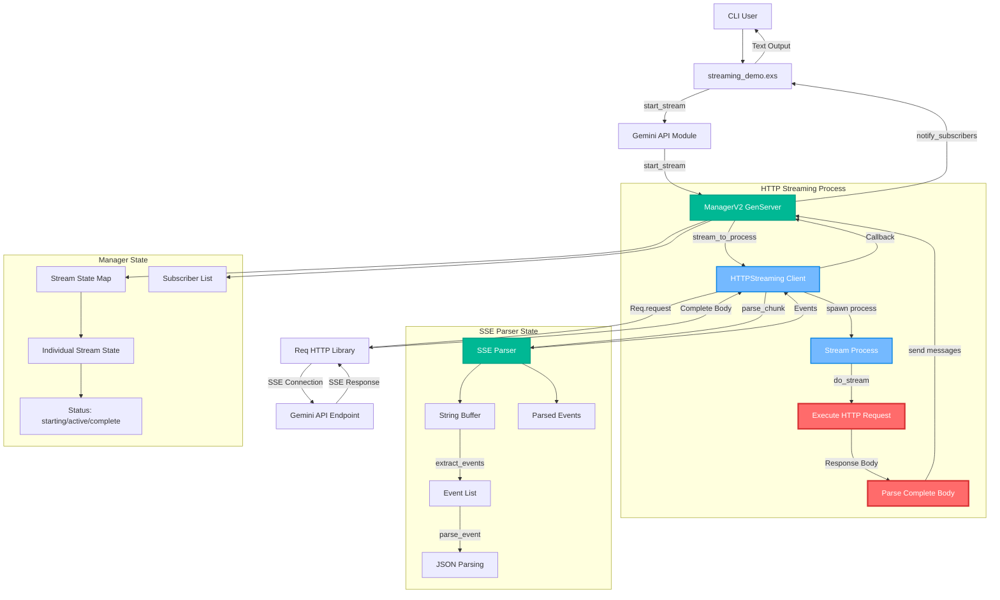
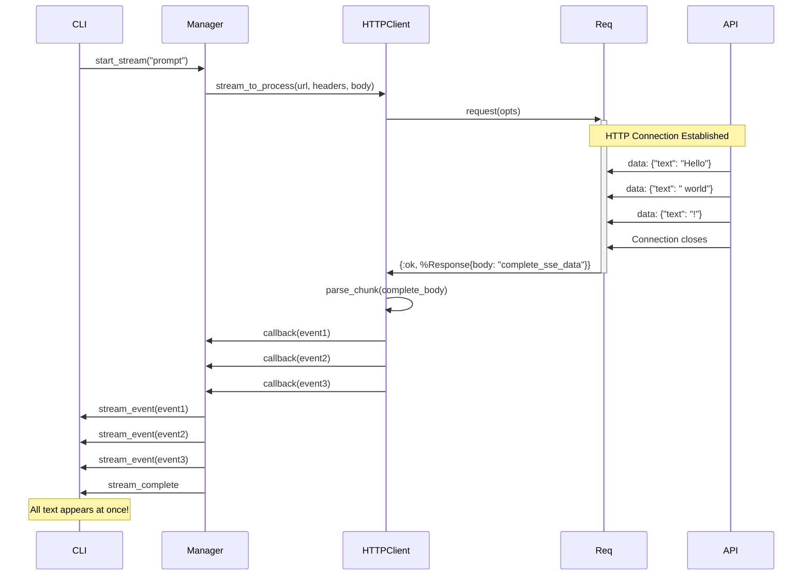
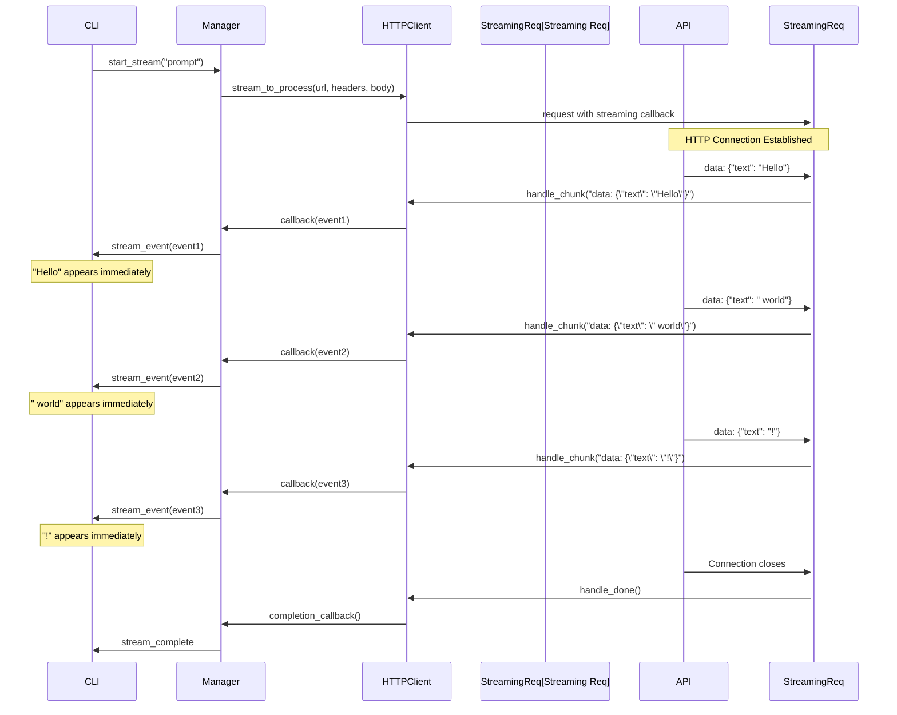

# Gemini Streaming Architecture

This document provides a comprehensive overview of the streaming architecture, identifies the current concurrency issue, and proposes solutions for true real-time streaming.

## Current Architecture Overview



## The Core Concurrency Problem

### Issue Identification

The current implementation has a **fundamental concurrency flaw** that prevents true real-time streaming:

1. **HTTP Request Blocking**: The `Req.request()` call waits for the **complete response body** before returning
2. **Batch Event Processing**: All SSE events are parsed **after** the HTTP response completes
3. **Delayed Notification**: Events are sent to subscribers only **after all data is received**

### Current Flow (Problematic)



## Solution: True Streaming Architecture

### Proposed Real-Time Flow



## Required Implementation Changes

### 1. Fix HTTP Streaming Layer

**Current Implementation (Broken)**:
```elixir
# lib/gemini/client/http_streaming.ex - CURRENT
case Req.request(req_opts) do
  {:ok, %Req.Response{status: status, body: body}} when status in 200..299 ->
    # Problem: body contains COMPLETE response
    case Parser.parse_chunk(body, parser) do
      {:ok, events, _final_parser} ->
        # All events processed at once!
```

**Required Implementation (Real-Time)**:
```elixir
# lib/gemini/client/http_streaming.ex - FIXED
req_opts = [
  method: :post,
  url: url,
  headers: add_sse_headers(headers),
  json: body,
  receive_timeout: timeout,
  # KEY CHANGE: Stream chunks as they arrive
  into: fn 
    {:status, status}, acc -> 
      %{acc | status: status}
    {:headers, headers}, acc -> 
      %{acc | headers: headers}
    {:data, chunk}, acc -> 
      # Process each chunk immediately!
      handle_streaming_chunk(chunk, acc, callback)
    :done, acc -> 
      finalize_stream(acc, callback)
  end
]
```

### 2. Implement Chunk-by-Chunk Processing

```elixir
defp handle_streaming_chunk(chunk, %{parser: parser} = acc, callback) do
  case Parser.parse_chunk(chunk, parser) do
    {:ok, events, new_parser} ->
      # Send events immediately as they're parsed
      Enum.each(events, fn event ->
        stream_event = %{type: :data, data: event.data, error: nil}
        callback.(stream_event)
      end)
      
      %{acc | parser: new_parser}
      
    {:error, error} ->
      error_event = %{type: :error, data: nil, error: error}
      callback.(error_event)
      acc
  end
end
```

### 3. Enhanced SSE Parser for Streaming

The current parser already supports stateful chunk processing, but we need to ensure it handles partial events correctly:

```elixir
# lib/gemini/sse/parser.ex - Verify this works correctly
defp extract_events(data) do
  # Handle both \r\n\r\n and \n\n patterns (FIXED)
  parts = String.split(data, ~r/\r?\n\r?\n/)
  
  case parts do
    [] -> {[], ""}
    [single_part] -> {[], single_part}  # No complete events
    multiple_parts ->
      {complete_events, [remaining]} = Enum.split(multiple_parts, -1)
      filtered_events = Enum.filter(complete_events, &(&1 != ""))
      trimmed_remaining = String.trim(remaining)
      {filtered_events, trimmed_remaining}
  end
end
```

### 4. Manager State Improvements

Ensure the manager can handle rapid event processing:

```elixir
# lib/gemini/streaming/manager_v2.ex
def handle_info({:stream_event, stream_id, event}, state) do
  case Map.get(state.streams, stream_id) do
    nil ->
      Logger.warning("Received event for unknown stream: #{stream_id}")
      {:noreply, state}

    stream_state ->
      # Update stream state
      updated_stream = %{
        stream_state
        | events_count: stream_state.events_count + 1,
          last_event_at: DateTime.utc_now(),
          status: :active
      }

      # Notify subscribers IMMEDIATELY - no batching
      notify_subscribers_immediately(updated_stream.subscribers, {:stream_event, stream_id, event})

      new_state = put_in(state.streams[stream_id], updated_stream)
      {:noreply, new_state}
  end
end

# Ensure immediate notification
defp notify_subscribers_immediately(subscribers, message) do
  Enum.each(subscribers, fn {pid, _ref} ->
    send(pid, message)  # Immediate send, no batching
  end)
end
```

## Testing the Fix

### 1. Update Demo to Show Timing

```elixir
# streaming_demo.exs - Add timing information
defp listen_for_events do
  start_time = System.monotonic_time(:millisecond)
  
  receive do
    {:stream_event, _stream_id, %{type: :data, data: data}} ->
      current_time = System.monotonic_time(:millisecond)
      elapsed = current_time - start_time
      
      text_content = extract_text_from_stream_data(data)
      if text_content && text_content != "" do
        IO.write("[#{elapsed}ms] #{text_content}")  # Show timing
      end
      listen_for_events()
      
    {:stream_complete, _stream_id} ->
      IO.puts("\n\n✅ Stream completed!")
  after
    30_000 ->
      IO.puts("\n⏰ Stream timeout after 30 seconds")
  end
end
```

### 2. Performance Verification

```elixir
# Test script to verify real-time behavior
defmodule StreamingTest do
  def test_realtime_performance do
    start_time = System.monotonic_time(:millisecond)
    event_times = []
    
    {:ok, stream_id} = Gemini.start_stream("Count slowly from 1 to 10")
    :ok = Gemini.subscribe_stream(stream_id)
    
    receive_loop(start_time, event_times)
  end
  
  defp receive_loop(start_time, event_times) do
    receive do
      {:stream_event, _, %{type: :data}} ->
        event_time = System.monotonic_time(:millisecond) - start_time
        new_times = [event_time | event_times]
        receive_loop(start_time, new_times)
        
      {:stream_complete, _} ->
        final_times = Enum.reverse(event_times)
        analyze_timing(final_times)
    end
  end
  
  defp analyze_timing(times) do
    intervals = times |> Enum.chunk_every(2, 1, :discard) |> Enum.map(fn [a, b] -> b - a end)
    
    IO.puts("Event timing analysis:")
    IO.puts("First event: #{hd(times)}ms")
    IO.puts("Average interval: #{Enum.sum(intervals) / length(intervals)}ms")
    IO.puts("All events: #{inspect(times)}")
  end
end
```

## Expected Behavior After Fix

1. **Immediate First Response**: First token should appear within 500-1000ms
2. **Progressive Display**: Each chunk should appear as it's generated, not all at once
3. **Low Latency**: Gap between API generation and CLI display should be <50ms
4. **No Buffering**: Text should stream continuously, not in large blocks

The current issue where "all text dumps out at the end" should be completely resolved with this streaming implementation.